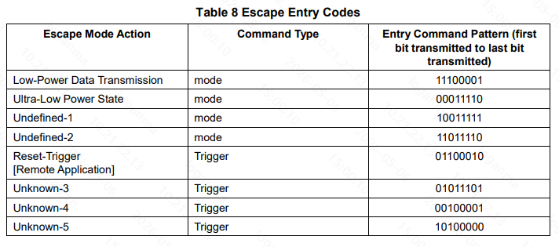
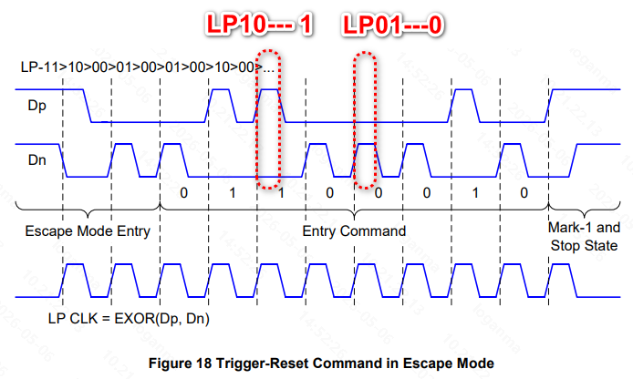

+++
date = '2026-06-30T23:46:46+08:00'
draft = false
title = 'Ulps'
categories = ["Display"]
tags = ["DPHY", "ULPS"]
+++

本文想讲下ULPS, 它是 D-PHY 定义的一种深度低功耗状态，适用于 data lane和 clock lane。核心特征是：
- Lane 长期保持LP-00
- PHY模拟电路可以进入低功耗状态
- 需要特点流程可进入 和 退出

但是在讲ULPS前，需要先引入escape mode。

# 1. Escape mode

Escape Mode 是一种基于低功耗（LP）状态的特殊工作模式，在该模式下可以提供额外的功能。Escape Mode 在正向（Forward）方向必须支持，在反向（Reverse）方向是可选的；即便支持，也不要求实现全部功能。
Data Lane 通过特定的进入流程进入 Escape Mode，该流程为：LP-11 → LP-10 → LP-00 → LP-01 → LP-00。当线路上观察到最后一个 Bridge 状态（LP-00）时，Lane 即进入 Escape Mode，并处于 Space 状态（LP-00）。如果在到达最终 Bridge 状态之前的任何时刻检测到 LP-11，则该进入流程必须中止，接收端应等待或返回到 Stop 状态。

对于 Data Lane，一旦进入 Escape Mode，发送端需要发送一个 8-bit 的入口命令，用于指示请求执行的操作。当前所有支持的 Escape Mode 命令及其对应行为在如下 Table 中定义，未分配的命令保留用于未来扩展。



| escape mode action                | command type | entry command pattern (first bit transmitted to last bit transmitted) |
| --------                          | --------     | --------                                                              |
| low-power data tranmission        | mode         | 11100001                                                              |
| ultra-low power state             | mode         | 00011110                                                              |
| undefined-1                       | mode         | 10011111                                                              |
| undefined-2                       | mode         | 11011110                                                              |
| reset-trigger; remote application | trigger      | 01100010                                                              |
| entry sequence for HS test mode   | trigger      | 01011101                                                              |
| unknown-4                         | trigger      | 00100001                                                              |
| unknown-5                         | trigger      | 10100000                                                              |


退出 Escape Mode 必须通过 Stop 状态实现，并且由于采用 Spaced-One-Hot 编码，在 Escape Mode 期间不会出现 Stop 状态。一旦进入 Stop 状态，Lane 会立即返回 Control Mode。如果接收到的入口命令不被支持，则该 Escape 操作应被忽略，接收端需等待发送端返回 Stop 状态。
在 Escape Mode 下，PHY 使用 Spaced-One-Hot 编码进行异步通信，因此 Data Lane 的操作不依赖 Clock Lane。Trigger-Reset 命令的完整 Escape Mode 操作流程示例见如下 Figure 18。



**Spaced-One-Hot** 编码意味着每一个 **Mark** 状态都会与一个 **Space** 状态交替出现。因此，每一个符号由两个部分组成：一个 One-Hot 阶段（Mark-0 或 Mark-1）以及一个 Space 阶段。发送端在传输“0 bit”时，应发送 Mark-0 后跟一个 Space；在传输“1 bit”时，应发送 Mark-1 后跟一个 Space。如果一个 Mark 状态后面没有跟随 Space，则该 Mark 不代表一个有效比特。在通过 Stop 状态退出 Escape Mode 之前，最后一个阶段必须是一个 Mark-1 状态，该状态不属于实际传输的数据，因为它后面没有跟随 Space。时钟可以通过对两条线路 Dp 和 Dn 进行异或（XOR）运算得到。每一个 LP 状态的持续时间必须至少为 **TLPX,MIN**。

这里需要解释下 **Spaced-One-Hot** 编码，基本编码单元是：
一个 bit = Mark + Space， mark 表示数据， space表示分隔符。
```c
0 bit -> Mark-0 + Space
1 bit -> Mark-1 + Space
---------------------------
上面可以写成：
0 -> (LP-01) + (LP-00)
1 -> (LP-10) + (LP-00)
```
特别注意的是：
- Space 一定是 LP-00, Mark 才承载 “0 / 1” 信息。
- Mark 后没有 Space ->无效 bit, 接收端不会采样，数据丢弃。
- 最后一个 Mark-1 不算数据，因为没有后续space LP-00。


# 2. ultra-low power state

当在进入 Escape 模式之后发送“进入超低功耗状态”的命令时，该 Lane 应进入 ULPS（超低功耗状态）。该命令需要被通知到接收端的协议层。在该状态期间，线路保持在 Space 状态（LP-00）。退出 ULPS 时，通过发送一个持续时间为 TWAKEUP 的 Mark-1 状态来实现，随后进入 Stop 状态。附录 A 描述了一个退出流程示例，以及一种用于控制 Mark-1 状态持续时间的方法。


1. ULPS不是“直接进”， 必须 **先进入Escape Mode**, 再通过**Escape command** 触发。
2. ULPS 的电气本质， 无论 Data Lane 还是 Clock Lane：ULPS = LP-00（长时间保持）。也就是，P = 0 ，N = 0 ，差分线无摆动。
3. ULPS Exit 的统一机制，无论哪种 Lane，关键只有一个，TWAKEUP 是必须满足的最小时间。
``` text
LP-00 (ULPS)
   ↓
LP-10 (Mark-1, 持续 TWAKEUP)
   ↓
LP-11 (Stop)
```
