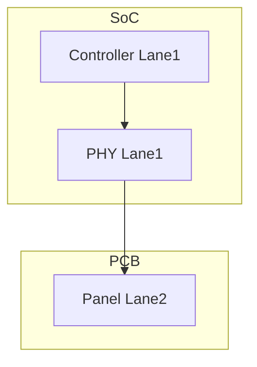
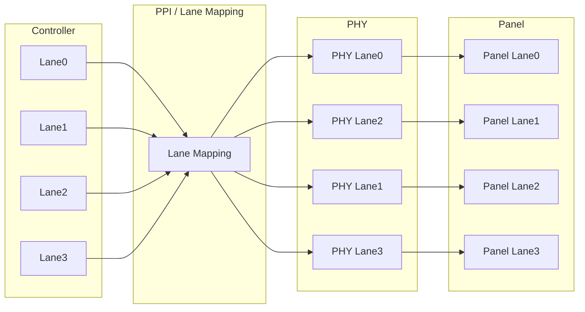

+++
date = '2026-07-09T21:44:23+08:00'
draft = false
title = 'Lane mapping'
categories = ["Display"]
tags = ["DSI"]
+++

# 什么是 Lane Mapping？

Lane Mapping（也称 Lane Swapping）是指：

> **将 DSI Controller 输出的逻辑 Data Lane，映射到不同的 D-PHY 物理 Data Lane。**

例如，一个 4-Lane DSI Host 默认连接关系如下：

```text
DSI Controller              D-PHY

Lane0  ----------------->  PHY Lane0
Lane1  ----------------->  PHY Lane1
Lane2  ----------------->  PHY Lane2
Lane3  ----------------->  PHY Lane3
```

这是默认的 **1:1 映射**。

如果配置了 Lane Mapping，则可以变为：

```text
DSI Controller              D-PHY

Lane0  ----------------->  PHY Lane0
Lane1  ----------------->  PHY Lane2
Lane2  ----------------->  PHY Lane1
Lane3  ----------------->  PHY Lane3
```

此时 Controller 输出的 **Lane1 数据** 实际会从 **PHY Lane2** 发出，而 **Lane2 数据** 则从 **PHY Lane1** 发出。

# 为什么需要 Lane Mapping？

主要原因是 **PCB 布线（Routing）**。

高速 MIPI DSI 对 PCB 走线要求很高：

* 差分长度匹配
* 阻抗控制
* 避免交叉
* 尽量减少过孔（Via）

实际 PCB 上，经常会出现：

```text
Controller          Panel

Lane0 -----------> Lane0
Lane1 -----------> Lane2
Lane2 -----------> Lane1
Lane3 -----------> Lane3
```

如果 Controller 固定采用 1:1 输出：



那么 Panel 接收到的 Lane 顺序就是错误的，链路无法正常工作。

启用 Lane Mapping 后，可以配置：

```text
LANE1_MAPPING = PHY2
LANE2_MAPPING = PHY1
```

这样无需修改 PCB，即可补偿物理走线造成的 Lane 交换。

# Lane Mapping 映射的是哪里？

很多人第一次看到文档会误以为：

> 是交换 D-PHY 外部的 Lane。

实际上并不是。

Lane Mapping 发生在 **DSI Controller 与 D-PHY 之间**。



也就是说：

> **Controller 的逻辑 Lane** 映射到 **D-PHY 的物理 Lane**。

外部连接到 Panel 的 MIPI Lane 并没有变化。

# Lane 与 PPI 的关系

这里容易产生一个疑问：

> Controller 与 PHY 之间不是 PPI 接口吗？为什么文档仍然说 Lane？

原因在于：

**PPI 是按 Lane 组织的接口。**

例如，一个 4-Lane PHY，并不是只有一组 16-bit 数据总线，而是：

```text
PPI

Lane0
    txdatahs[15:0]

Lane1
    txdatahs[15:0]

Lane2
    txdatahs[15:0]

Lane3
    txdatahs[15:0]
```

每一条 Data Lane 都有自己独立的一组 PPI 信号。

因此：

文档中的

```text
Controller Lane1
```

实际上就是：

```text
PPI Lane1
```

Lane Mapping 做的就是：

```text
Controller Lane1
        │
        ▼
PPI Lane2
        │
        ▼
PHY Lane2
```

而不是交换某一条 16-bit 数据总线内部的 bit。

# 为什么 Lane0 不能交换？

S家 Databook 中说明：

> PHY data lanes (except data lane 0) can be swapped.

即：

* Lane1 ✔
* Lane2 ✔
* Lane3 ✔
* Lane0 ✘

这是因为 **Data Lane0 在 MIPI D-PHY 中承担特殊功能**，例如：

* Escape Mode（LP 传输）
* Bus Turn-Around（BTA）
* Read Response
* Trigger Command

很多控制流程都固定通过 Lane0 完成，因此 Lane0 必须保持固定，不能参与 Mapping。

# 为什么仅支持 3 Lane/4 Lane？

Databook 中还有一句：

> Lane swapping feature is only available when the number of PHY lanes is greater than 2.

原因很简单：

* **1-Lane**：只有 Lane0，没有可交换对象。
* **2-Lane**：Lane0 固定，仅剩 Lane1，也没有可交换对象。
* **3-Lane**：Lane1、Lane2 可以交换。
* **4-Lane**：Lane1、Lane2、Lane3 可以任意映射。

因此，只有当 **Data Lane 数量大于 2** 时，Lane Mapping 才真正有意义。

# 总结

Lane Mapping 的本质是：

> **通过软件重新连接 Controller 的逻辑 Lane 与 D-PHY 的物理 Lane，以适配 PCB 上的 Lane 交换。**

需要注意几点：

* **Lane Mapping 发生在 Controller 与 D-PHY（PPI）之间**，不是修改 MIPI 协议中的 Lane 编号。
* **PPI 是按 Lane 组织的接口**，每条 Data Lane 都拥有独立的一组 PPI 信号，因此 Mapping 实际上是在不同的 PPI Lane 与 PHY Lane 之间建立连接。
* **Lane0 始终固定**，因为它承担了 LP 通信、BTA、读返回等特殊功能。
* **Lane Mapping 的主要目的不是提升性能，而是提高 PCB 布线的灵活性**，使硬件设计可以在满足高速布线约束的同时，通过软件完成 Lane 顺序的补偿，而无需修改 PCB。
