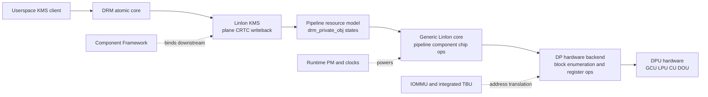
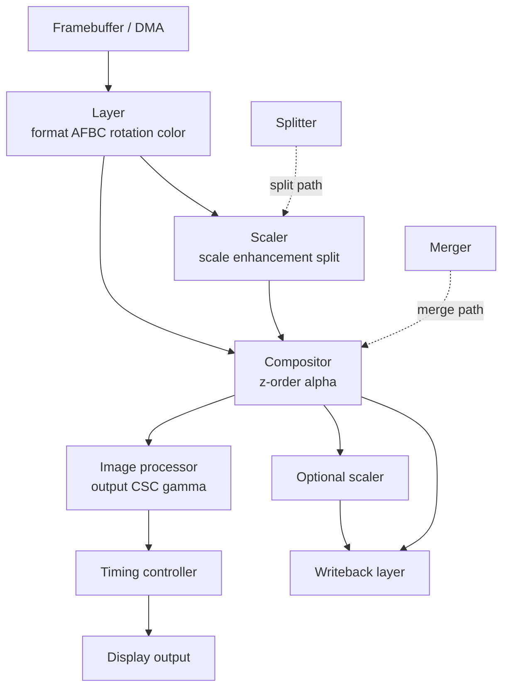
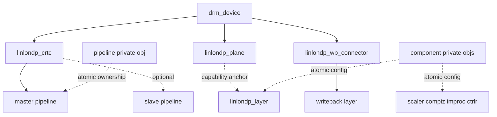
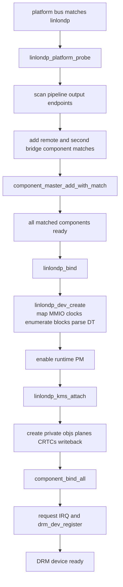

+++
date = '2026-08-23T12:14:24+08:00'
draft = false
title = 'linlon dpu 架构分析'
categories = ["Display"]
tags = ["Linux", "DPU"]
+++

## 1. 驱动职责

该驱动是一个 DRM/KMS atomic display controller 驱动，支持 DT compatible `armchina,linlon-d2`、`linlon-d6`、`linlon-d8`。它承担四类职责：

- 通过 Component Framework 等待 pipeline 下游显示 component 就绪，并创建 DRM device。
- 从 DPU 寄存器 block header 枚举硬件能力，而不是把 layer/scaler 数量完全写死。
- 把 DRM plane/CRTC/writeback 请求映射为硬件 component 数据流，并在 atomic state 中完成冲突检测。
- 管理时钟、IOMMU/TBU、IRQ、shadow register flush、vblank/page-flip/writeback completion 和 PM。

## 2. 软件分层

这几层的边界很明确：KMS 层理解 DRM 对象；pipeline 层理解数据流和资源图；`hw/dp_*` 理解 block header、寄存器和产品能力。两组函数表是跨层接口：`linlondp_dev_funcs` 控制整机，`linlondp_component_funcs` 控制单个硬件 block。

## 3. 硬件数据通路

典型显示通路不是固定的一条链。输入 layer 可以直达 compositor，也可以经 scaler；双 pipeline、split、side-by-side 和 writeback 会增加 merger/splitter 分支。

源码中 `linlondp_build_display_data_flow()` 明确完成 `compiz -> improc -> timing_ctrlr` 的输出段；plane 和 writeback 的前半段则根据缩放、split 和 SBS 条件动态选择（`linlondp_pipeline_state.c:1580`）。

## 4. GCU/LPU/CU/DOU 责任

| 硬件域 | 驱动中的含义 | 主要事件/操作 |
|---|---|---|
| GCU | Global Control Unit，全局模式和配置提交 | opmode、`CONFIG_VALID`、flip/config-valid IRQ、全局错误 |
| LPU | Layer Processing Unit，取数、格式、AFBC、writeback/TBU | AXI/TBU 错误、EOW、input busy |
| CU | Composition Unit，compositor/scaler/splitter/merger | composition/scaling 配置错误、overflow |
| DOU | Display Output Unit，improc、timing/output | VSYNC、underrun、timing/error |

`dp_enum_resources()` 先读取 GCU 的 block/pipeline 数量，再以固定 block stride 扫描 block header，`dp_probe_block()` 按 block type 创建相应通用 component（`hw/dp_dev.c:451`, `hw/dp_component.c:1535`）。这使 KMS 层依赖枚举结果，而不是依赖某一产品的硬编码拓扑。

## 5. DRM/KMS 对象映射

重要约束是：`linlondp_plane.layer` 表示一组能力相同的可用 layer 的入口/能力锚点，并不表示 plane 永久占有一个物理 layer（`linlondp_kms.h:37`）。真正的使用者绑定存在 atomic 的 `linlondp_component_state.binding_user` 中。

## 6. 注册架构

platform probe 只解析 DT graph 并注册 component master。只有下游 component 全部满足匹配后，Component Framework 才调用 `linlondp_bind()`，随后创建设备和 KMS 对象。

这种两阶段 discovery 避免在 bridge/connector 未 probe 时创建不完整的 DRM topology。相关入口位于 `linlondp_drv.c:173`、`linlondp_drv.c:75` 和 `linlondp_kms.c:520`。

## 7. 回调模型

| 回调表 | 注册者 | 框架调用时机 | 关键实现 |
|---|---|---|---|
| `platform_driver` | module | probe/remove、PM | `linlondp_platform_probe/remove` |
| `component_master_ops` | platform probe | component 集合 bind/unbind | `linlondp_bind/unbind` |
| `drm_mode_config_funcs` | KMS attach | atomic check/commit、FB create | `linlondp_kms_check`, helper commit |
| `drm_crtc_helper_funcs` | CRTC add | check/flush/enable/disable | `linlondp_crtc_*` |
| `drm_plane_helper_funcs` | plane add | plane check/update | update 为空，硬件集中在 CRTC flush |
| `drm_encoder_helper_funcs` | writeback init | writeback atomic check | `linlondp_wb_encoder_atomic_check` |
| `linlondp_dev_funcs` | `dp_identify()` | core 控制硬件 | enum/IRQ/opmode/flush/IOMMU |
| `linlondp_component_funcs` | block init | validate 后 commit/disable | 各 `dp_*_update/disable` |

## 8. 设计结论

- 这是“硬件图 + 事务状态”架构，而不是 plane 到寄存器 block 的静态一对一映射。
- plane atomic update 故意为空；CRTC flush 统一更新所有 component，保证跨 component 的 shadow register 配置一起生效。
- pipeline master/slave 同时服务普通双 pipeline 合并和 side-by-side；SBS 中 slave 先经自己的 improc，再合入 master improc。
- GCU 的 configuration-valid 是软件提交与硬件生效的边界，FLIP IRQ 是 commit 完成的主要确认信号。
