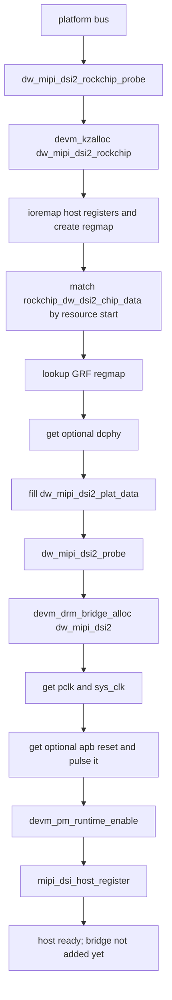
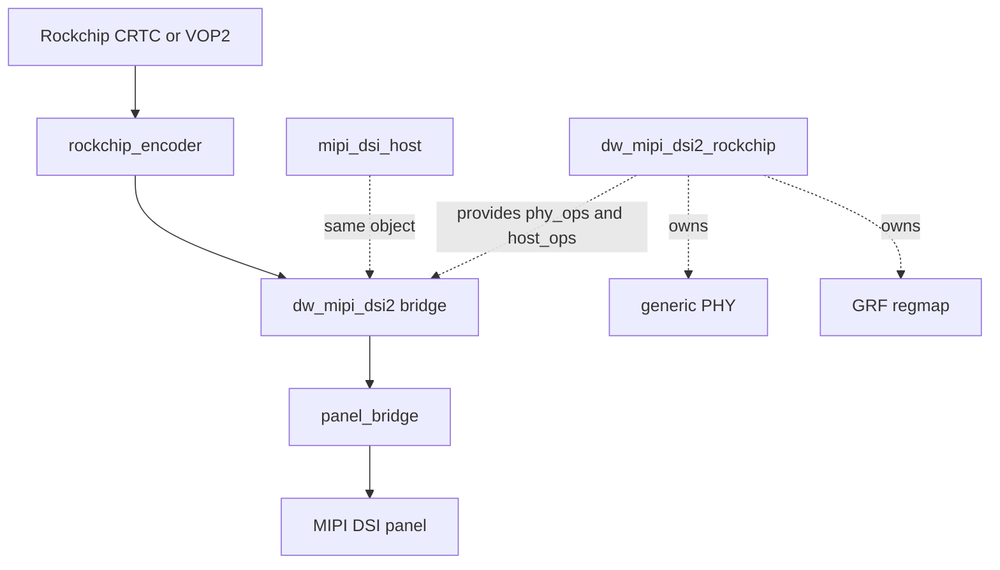
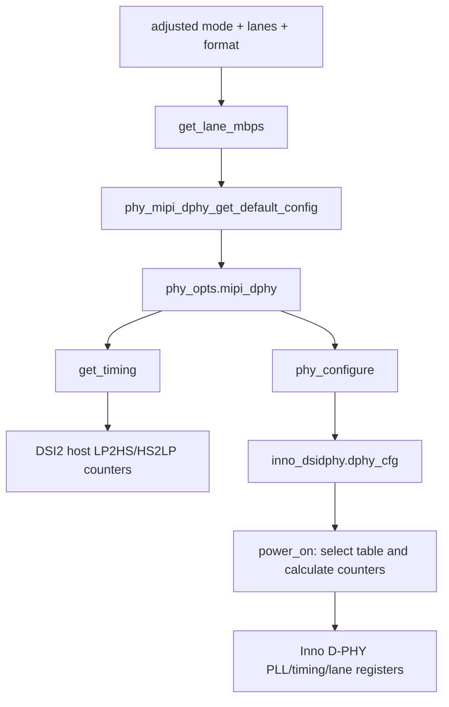

+++
date = '2026-07-02T12:14:24+08:00'
draft = true
title = 'rk mipi dsi2 架构分析'
+++

# 架构分析

## 1. 驱动分层

从架构上看，这个 DSI2 驱动不是单文件 host 驱动，而是三个层次叠在一起：

1. Linux framework 层
   - `platform_driver`
   - `mipi_dsi_host`
   - `drm_bridge`
   - `drm_encoder`
   - `component framework`
   - `PHY framework`
   - `clk/reset/regmap/pm_runtime`
2. Synopsys 通用 core 层
   - 文件：`dw-mipi-dsi2.c`
   - 负责 DWC host IP 的寄存器编程、bridge 回调、DSI message 发送接收
3. Rockchip glue 层
   - 文件：`dw-mipi-dsi2-rockchip.c`
   - 负责 SoC 差异、GRF、PHY 参数推导、和 Rockchip DRM encoder 对接

它的职责切分非常明确：

- 通用 core 只关心“如何驱动 DWC DSI2 IP”。
- Rockchip glue 只关心“如何把这个 IP 放进 Rockchip 显示管线”。

## 2. 为什么要拆成两层

这份实现最大的价值，不是“能驱动 DSI2”，而是把平台无关逻辑和平台相关逻辑拆开了。

### 2.1 通用 core 保留的责任

`dw-mipi-dsi2.c` 负责：

- host register 读写
- command mode、video mode、data stream mode 切换
- IPI timing 与颜色深度寄存器配置
- `mipi_dsi_host_ops.transfer`
- `drm_bridge_funcs`
- 时钟、复位、runtime PM 的通用时序

这些逻辑都和 Rockchip 无关，只和 DWC DSI2 IP 本身有关。

### 2.2 Rockchip glue 保留的责任

`dw-mipi-dsi2-rockchip.c` 负责：

- 选择 SoC 实例对应的 GRF 布局
- 计算 lane rate 上限
- 调用通用 PHY framework 计算 `phy_configure_opts`
- 生成 DPHY 的 LP/HS timing
- 创建 `rockchip_encoder`
- 把输出模式写进 `rockchip_crtc_state`

这些逻辑和 `rk3576`、`rk3588` 的 SoC 布局、VOP2 管线、GRF 定义直接相关，不适合放到通用 core。

## 3. 平台抽象契约

通用 core 与平台 glue 之间的耦合点是 `struct dw_mipi_dsi2_plat_data`，定义在 `dw_mipi_dsi2.h:63`。

它承载了三类信息：

1. 资源注入
   - `regmap`
   - `max_data_lanes`
   - `priv_data`
2. 能力回调
   - `mode_valid`
   - `mode_fixup`
   - `get_input_bus_fmts`
3. 平台操作回调
   - `phy_ops`
   - `host_ops`

这意味着通用 core 并不直接依赖 Rockchip 的任何类型，只依赖一组函数指针和 opaque `priv_data`。

## 4. 关键架构特点

## 4.1 一个对象兼任 Host 和 Bridge

`struct dw_mipi_dsi2` 同时内嵌：

- `struct mipi_dsi_host`
- `struct drm_bridge`

位置见 `dw-mipi-dsi2.c:192-209`。

这种设计很合理，因为 DSI host controller 在显示栈里本来就是“既是协议主机，又是显示路径桥接点”：

- 对上，它向面板或下游 bridge 提供 `mipi_dsi_host`
- 对左，它向 DRM 显示流水线提供 `drm_bridge`

因此同一个对象同时服务两套框架，避免了双对象同步状态。

## 4.2 bridge 并不是 probe 时立即注册

这是本驱动最值得注意的架构细节之一。

在 `__dw_mipi_dsi2_probe()` 中，generic core 只做了：

- 分配 `struct dw_mipi_dsi2`
- 初始化时钟、reset、regmap
- `mipi_dsi_host_register()`

位置见 `dw-mipi-dsi2.c:909-989`。

但 `drm_bridge_add(&dsi2->bridge)` 并不在 probe 里，而是在 `dw_mipi_dsi2_host_attach()` 里执行：

- `dw-mipi-dsi2.c:512-547`

也就是说：

- probe 成功，只代表“host controller 可以接收 DSI peripheral attach”
- 真正把 bridge 放进 DRM 拓扑，要等下游 `mipi_dsi_device` 出现并 attach 后才发生

这样做的好处是，bridge 注册时已经知道了：

- lanes
- channel
- pixel format
- mode flags
- 下游 panel bridge

从而 bridge 生命周期和实际拓扑更一致。

## 4.3 encoder 创建也被延后

Rockchip glue 并没有在 platform probe 阶段创建 encoder。

相反，它在：

- `dw_mipi_dsi2_rockchip_host_attach()`
  - `dw-mipi-dsi2-rockchip.c:338-349`

里调用 `component_add()`，随后由 Rockchip DRM master 在 bind 阶段回调：

- `dw_mipi_dsi2_rockchip_bind()`
  - `dw-mipi-dsi2-rockchip.c:304-323`

这里才真正：

- 创建 `drm_encoder`
- 设置 `crtc_endpoint_id`
- 把 generic DSI bridge attach 到 encoder 上

这个设计把显示拓扑的“最终拼装”延后到了 component bind 阶段，符合 Rockchip DRM 统一管理显示子设备的风格。

---
这里需要确认 `dw_mipi_dsi2_rockchip_host_attach` 被谁调用了？
在 `dw_mipi_dsi2_host_attach()` 中，调用了平台 `host_ops->attach()`

## 4.4 PHY 仍是外部平台责任

generic core 需要知道：

- lane rate
- PPI width
- LP2HS / HS2LP timing
- 上电/下电流程

但它不自行理解任何 PHY 寄存器，而是完全通过 `phy_ops` 间接完成。

这一点在 `dw_mipi_dsi2_mode_set()` 中很清楚：

- `get_lane_mbps()`
- `dw_mipi_dsi2_phy_init()` 内部调用 `get_interface()` 和 `get_timing()`
- `power_on()`
- `power_off()`

对应位置：

- `dw-mipi-dsi2.c:780-822`
- `dw-mipi-dsi2.c:351-398`

因此 generic core 只知道“DWC host 需要什么 PHY 参数”，并不知道“平台 PHY 如何实现这些参数”。

## 4.5 Runtime PM 只作为电源引用计数

generic core 在 probe 中调用 `devm_pm_runtime_enable()`：

- `dw-mipi-dsi2.c:974`

在 enable 路径中：

- `pm_runtime_get_sync()`
  - `dw-mipi-dsi2.c:796`

在 disable 路径中：

- `pm_runtime_put()`
  - `dw-mipi-dsi2.c:771`

但代码里没有为这个 driver 实现显式的 runtime suspend/resume 回调。说明当前 runtime PM 更多是“让上层电源域/时钟域处于活动状态”的引用计数工具，而不是一个在本驱动内自行保存/恢复寄存器状态的 PM 子系统。

## 5. Probe 架构

先看 Rockchip 顶层 probe：

- `dw_mipi_dsi2_rockchip_probe()`
  - `dw-mipi-dsi2-rockchip.c:374-430`

它做四件事：

1. 解析本平台资源
   - host MMIO
   - GRF regmap
   - optional PHY
2. 根据 resource start 地址匹配 `chip_data`
3. 构造 `dw_mipi_dsi2_plat_data`
4. 调用 `dw_mipi_dsi2_probe()` 初始化 generic core

generic core probe 再继续完成：

1. bridge 对象分配
2. host/regmap/clock/reset 初始化
3. runtime PM enable
4. `mipi_dsi_host_register()`

也就是说，Rockchip probe 是“平台实例化”，generic probe 是“IP 功能实例化”。

### Probe 流程图

## 6. Attach 和 Bind 的双阶段拓扑拼装

此驱动的显示拓扑不是 probe 一次性搭完，而是分成两个阶段。

### 阶段 A：DSI peripheral attach

在 `dw_mipi_dsi2_host_attach()` 中：

- 保存 `lanes/channel/format/mode_flags`
- 通过 `devm_drm_of_get_bridge()` 找到下游 panel bridge
- `drm_bridge_add(&dsi2->bridge)`
- 调用平台 `host_ops->attach()`

位置：

- `dw-mipi-dsi2.c:512-547`

对于 Rockchip 平台，`host_ops->attach()` 的实现是：

- `component_add(dsi2->dev, &dw_mipi_dsi2_rockchip_ops)`
- `dw-mipi-dsi2-rockchip.c:338-349`

### 阶段 B：Rockchip component bind

在 `dw_mipi_dsi2_rockchip_bind()` 中：

- 创建 `drm_encoder`
- 设置 encoder 对应的远端 CRTC endpoint id
- `dw_mipi_dsi2_bind()` 把 generic bridge 接到 encoder

位置：

- `dw-mipi-dsi2-rockchip.c:304-323`
- `dw-mipi-dsi2.c:1017-1019`

完成后，generic bridge 自己的 `.attach()` 再把 panel bridge 接到 bridge 链后端：

- `dw-mipi-dsi2.c:873-885`

最终拓扑为：

`CRTC -> Rockchip encoder -> dw_mipi_dsi2 bridge -> panel bridge -> panel`

### 拓扑关系图

## 7. 使能路径的架构分工

显示使能发生在 bridge 和 encoder 回调组合里。

### generic bridge 负责

- 保存 adjusted mode
  - `dw_mipi_dsi2_bridge_mode_set()`
  - `dw-mipi-dsi2.c:833-841`
- 上电、软复位、配置 PHY/IPI、进入 command mode
  - `dw_mipi_dsi2_bridge_atomic_pre_enable()`
  - `dw_mipi_dsi2_mode_set()`
  - `dw-mipi-dsi2.c:780-830`
- 切换到 video mode 或 data stream mode
  - `dw_mipi_dsi2_bridge_atomic_enable()`
  - `dw-mipi-dsi2.c:843-853`
- 关闭时回到 command mode、power off、clock off
  - `dw_mipi_dsi2_bridge_post_atomic_disable()`
  - `dw-mipi-dsi2.c:748-772`

### Rockchip encoder 负责

- 把 DSI pixel format 映射成 Rockchip `output_mode`
  - `dw_mipi_dsi2_encoder_atomic_check()`
  - `dw-mipi-dsi2-rockchip.c:240-276`
- 在 enable 阶段把颜色深度写入 GRF
  - `dw_mipi_dsi2_encoder_atomic_enable()`
  - `dw-mipi-dsi2-rockchip.c:214-238`

因此，generic bridge 负责“DWC host 本身可工作”，Rockchip encoder 负责“让 Rockchip 显示输出口和 DSI host 在并行输入接口格式上对齐”。

---
s->output_mode = ROCKCHIP_OUT_MODE_P666; 和 s->bus_format 的区别是什么？

## 8. 命令通道的架构

`mipi_dsi_host_ops.transfer` 实现位于：

- `dw_mipi_dsi2_host_transfer()`
  - `dw-mipi-dsi2.c:650-687`

它的逻辑是：

1. 根据 `MIPI_DSI_MSG_USE_LPM` 设置 `LPDT_DISPLAY_CMD_EN`
2. 调用 `mipi_dsi_create_packet()` 组包
3. 等待 command FIFO 空闲
4. 逐字写入 payload 到 `DSI2_CRI_TX_PLD`
5. 写 header 到 `DSI2_CRI_TX_HDR`
6. 如有读请求，再从 `DSI2_CRI_RX_HDR/PLD` 拉回响应

这说明当前 driver 把 DSI control path 完整建立在 DWC 的 CRI command interface 之上，而显示视频流路径则走 IPI/video mode 配置。

## 9. 当前实现的几个显著取舍

### 9.1 单实例单链路假设

`dw_mipi_dsi2_get_lanes()` 直接返回 `dsi2->lanes`，代码注释明确写了：

- `single-dsi, so no other instance to consider`
- `dw-mipi-dsi2.c:774-778`

因此当前实现没有做 dual-DSI 聚合带宽或双 host 协调。

### 9.2 header 中的 `.init` 被要求存在，但当前 core 并未调用

`__dw_mipi_dsi2_probe()` 会检查：

- `plat_data->phy_ops->init`
- `plat_data->phy_ops->get_lane_mbps`
- `plat_data->phy_ops->get_timing`

位置：

- `dw-mipi-dsi2.c:926-928`

但当前 generic runtime 代码里并没有实际调用 `phy_ops->init()`。Rockchip 于是提供了一个空实现：

- `dw-mipi-dsi2-rockchip.c:97-100`

这说明接口设计预留了更强的平台 PHY 初始化能力，但当前实现暂未使用。

### 9.3 `get_esc_clk_rate()` 也处于预留状态

`dw_mipi_dsi2_phy_ops` 里定义了 `get_esc_clk_rate()`：

- `dw_mipi_dsi2.h:42-54`

但这套代码并未使用。escape clock divider 由 generic core 直接按 `sys_clk` 推导：

- `dw_mipi_dsi2_phy_clk_mode_cfg()`
  - `dw-mipi-dsi2.c:302-319`

### 9.4 没有 IRQ 处理路径

虽然 `dw-mipi-dsi2.c` 定义了多组 interrupt status/mask 寄存器，但当前驱动没有：

- `request_irq()`
- IRQ handler
- 错误中断恢复流程

这说明当前版本依赖轮询和同步命令路径，错误处理偏保守简化。

## 10. PHY 三层职责边界

把 PHY 加入后，实际架构是三层协作：

- `dw-mipi-dsi2.c` 只写 DSI2 host 寄存器，通过 `plat_data->phy_ops` 请求 lane rate、接口宽度、LP/HS 边界和 power transition，不知道 PHY 寄存器布局。
- `dw-mipi-dsi2-rockchip.c` 是翻译层。它根据 mode、pixel format、lane 数计算 `lane_mbps`，调用 `phy_mipi_dphy_get_default_config()` 生成标准 D-PHY 配置，并把配置转换为 DSI2 host timing。
- `phy-rockchip-inno-dsidphy.c` 是 PHY provider。它保存 `phy_configure_opts_mipi_dphy`，按 PLL rate 选择 Inno timing table，换算为硬件 counter，编程 PLL、clock/data lane 和 turnaround 参数。

因此 `get_timing()` 的结果不是 PHY 寄存器配置。它只用于 DSI2 host 的 `DSI2_PHY_LP2HS_MAN_CFG` 和 `DSI2_PHY_HS2LP_MAN_CFG`；真正的 PHY 寄存器写入发生在后续 `phy_power_on()` 的 provider 回调中。

## 11. PHY 时序数据流

`phy_opts` 是一次 mode set 的中间结果，连接了两个硬件模块：同一组标准 D-PHY timing 输入，一份被 glue 聚合给 DSI2 host，另一份被 Inno PHY 细化成各个 lane 的寄存器字段。
