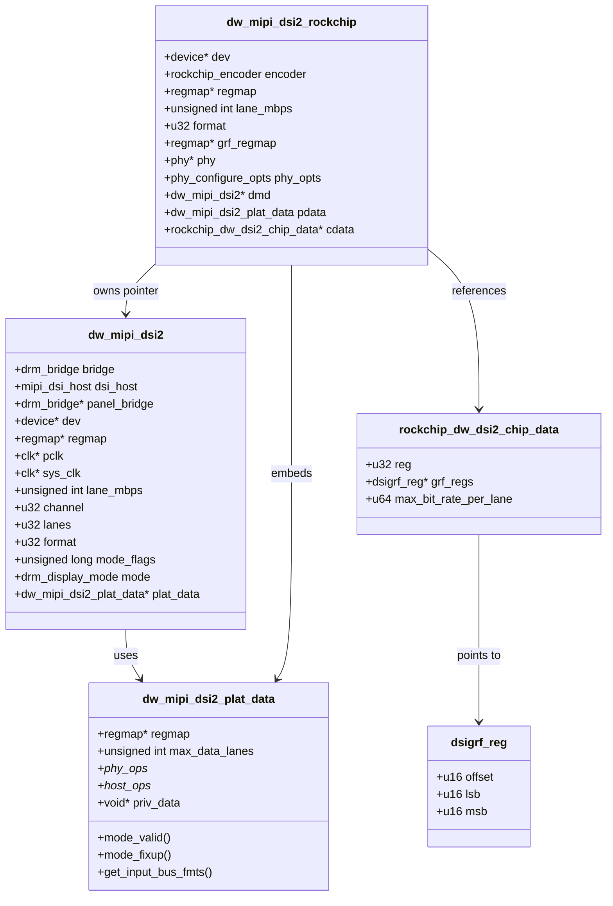

+++
date = '2026-07-02T19:27:34+08:00'
draft = true
title = '数据结构分析'
+++

## 1. 对象总览

这个驱动最重要的对象有四个：

1. `struct dw_mipi_dsi2`
2. `struct dw_mipi_dsi2_rockchip`
3. `struct dw_mipi_dsi2_plat_data`
4. `struct rockchip_dw_dsi2_chip_data`

它们不是平铺关系，而是明显的“core 对象 + platform wrapper + callback contract + SoC descriptor”模型。

## 2. `struct dw_mipi_dsi2`

定义位置：

- `dw-mipi-dsi2.c:192-209`

### 2.1 目的

这是 Synopsys DWC DSI2 host controller 的运行时核心对象。

它的职责是：

- 作为 `mipi_dsi_host`
- 作为 `drm_bridge`
- 保存当前链路协商结果
- 保存当前显示 mode
- 持有 DWC host 需要的 clock 和 regmap

### 2.2 关键字段

| 字段 | 作用 |
| --- | --- |
| `bridge` | 把 DSI host 作为 DRM bridge 暴露给显示管线 |
| `dsi_host` | 为 panel/bridge 提供 MIPI DSI host 接口 |
| `panel_bridge` | 保存下游 bridge，供 `.attach()` 时串链 |
| `regmap` | DWC host 寄存器访问入口 |
| `pclk` / `sys_clk` | APB 和系统时钟 |
| `lane_mbps` | 每 lane 的 HS 速率 |
| `channel` | DSI virtual channel |
| `lanes` | 数据 lane 数 |
| `format` | DSI pixel format |
| `mode_flags` | `MIPI_DSI_MODE_*` 标志 |
| `mode` | bridge `mode_set()` 缓存的 adjusted mode |
| `plat_data` | 平台回调和注入资源 |

### 2.3 生命周期

分配：

- `devm_drm_bridge_alloc()`
- `dw-mipi-dsi2.c:918-919`

初始化：

- 设置 `dev`
- 设置 `plat_data`
- 获取 clock/reset/regmap
- 初始化 `dsi_host.ops`
- `dw-mipi-dsi2.c:923-978`

注册：

- `mipi_dsi_host_register()`
- `dw-mipi-dsi2.c:978`

bridge 注册：

- `drm_bridge_add()`
- `dw-mipi-dsi2.c:538`

释放：

- `mipi_dsi_host_unregister()`
- `dw-mipi-dsi2.c:991-994`

### 2.4 为什么 bridge 和 host 要放在同一个对象里

因为这两个角色共享大量状态：

- lane 数
- format
- mode flags
- 当前显示 mode
- 对下游 panel bridge 的引用
- host 寄存器访问入口

如果拆成两个对象，需要同步这些字段，反而会增加时序错误和状态不一致的风险。

## 3. `struct dw_mipi_dsi2_rockchip`

定义位置：

- `dw-mipi-dsi2-rockchip.c:61-76`

### 3.1 目的

这是 Rockchip 平台包装对象。

它的职责不是直接实现 DWC host，而是：

- 保存 Rockchip 侧的显示输出语义
- 提供 PHY 相关回调
- 提供 component bind 所需的 encoder
- 保存 GRF/PHY/SoC descriptor
- 承载传给 generic core 的 `plat_data`

### 3.2 关键字段

| 字段 | 作用 |
| --- | --- |
| `encoder` | Rockchip DRM encoder，对接 CRTC |
| `regmap` | DWC host register map，传给 generic core |
| `lane_mbps` | Rockchip 侧缓存的 lane 速率 |
| `format` | 当前 DSI pixel format，供 encoder 和 PHY 逻辑使用 |
| `grf_regmap` | GRF 写入口，用于配置 SoC 侧接口字段 |
| `phy` | optional 外部 PHY handle |
| `phy_opts` | 由 PHY framework 计算出的 DPHY 配置 |
| `dmd` | generic `struct dw_mipi_dsi2 *` |
| `pdata` | 传给 generic core 的平台回调表 |
| `cdata` | SoC/instance 级别静态描述信息 |

---
`grf_regmap` 的作用是？

### 3.3 所有权

`dw_mipi_dsi2_rockchip` 是顶层 owner：

- 它 own `pdata`
- 它引用 generic core `dmd`
- 它 own `rockchip_encoder`
- 它 own `phy_opts`
- 它引用 `grf_regmap` 和 `phy`

generic core 并不拥有 Rockchip 对象，只是通过 `plat_data->priv_data` 回调回去。

## 4. `struct dw_mipi_dsi2_plat_data`

定义位置：

- `dw_mipi_dsi2.h:63-87`

### 4.1 目的

这是 generic core 和平台 glue 之间的 ABI 风格契约。

它把平台差异压缩成一组回调，而不是让 generic core 直接依赖具体平台类型。

### 4.2 关键成员解析

| 成员 | 含义 |
| --- | --- |
| `regmap` | 可由平台预先创建并注入 |
| `max_data_lanes` | 平台可支持的最大 lane 数 |
| `mode_valid` | 平台二次约束 mode 合法性 |
| `mode_fixup` | 平台修正 adjusted mode |
| `get_input_bus_fmts` | 把 bridge 输入总线格式暴露给上游 |
| `phy_ops` | DWC host 所需的 PHY 抽象 |
| `host_ops` | host attach/detach 时的平台扩展动作 |
| `priv_data` | 平台私有上下文 |

### 4.3 设计价值

这个结构解决了三个问题：

1. 通用 core 可以复用在不同 SoC 上
2. platform glue 可以把自己的数据结构隐藏在 `priv_data` 后面
3. 某些平台扩展能力是可选的，不需要污染 core 主路径

## 5. `struct dw_mipi_dsi2_phy_ops`

定义位置：

- `dw_mipi_dsi2.h:42-54`

这是 generic core 对 PHY 的最小依赖面。

当前 Rockchip 实现如下：

- `init`
  - 空实现
  - `dw-mipi-dsi2-rockchip.c:97-100`
- `power_on`
  - `phy_set_mode(PHY_MODE_MIPI_DPHY)`
  - `phy_configure()`
  - `phy_power_on()`
  - `dw-mipi-dsi2-rockchip.c:102-115`
- `power_off`
  - `phy_power_off()`
  - `dw-mipi-dsi2-rockchip.c:117-122`
- `get_interface`
  - 固定返回 16-bit PPI 和 DPHY
  - `dw-mipi-dsi2-rockchip.c:171-176`
- `get_lane_mbps`
  - 根据 mode、bpp、lane 数和 burst 模式计算
  - `dw-mipi-dsi2-rockchip.c:124-169`
- `get_timing`
  - 由 `phy_opts.mipi_dphy` 推导 LP2HS/HS2LP 时间
  - `dw-mipi-dsi2-rockchip.c:178-203`

### 5.1 这里体现的抽象边界

generic core 只关心三类 PHY 输出：

- 链路速率
- 接口宽度和 PHY 类型
- 状态切换 timing

至于这些值是怎么算出来的，完全交给平台层。

## 6. `struct dw_mipi_dsi2_host_ops`

定义位置：

- `dw_mipi_dsi2.h:56-61`

Rockchip 当前只实现了 attach/detach：

- attach 时 `component_add()`
  - `dw-mipi-dsi2-rockchip.c:338-349`
- detach 时 `component_del()`
  - `dw-mipi-dsi2-rockchip.c:351-358`

这说明 `host_ops` 的用途不是传输协议，而是当 DSI peripheral 被发现时，给平台一个机会把 DRM 子设备拓扑拼起来。

## 7. `struct rockchip_dw_dsi2_chip_data`

定义位置：

- `dw-mipi-dsi2-rockchip.c:55-59`

### 7.1 目的

这是 SoC/实例描述符，而不是运行时状态。

包含：

- `reg`
  - 用 MMIO base 地址区分具体实例
- `grf_regs`
  - 该实例对应的 GRF bitfield 布局
- `max_bit_rate_per_lane`
  - lane 带宽上限

### 7.2 为什么用 resource start 匹配实例

Rockchip 的 `rk3588` 有两个 DSI2 controller：

- `0xfde20000`
- `0xfde30000`

对应不同的 GRF offset：

- `dw-mipi-dsi2-rockchip.c:476-486`

probe 阶段通过 `resource->start` 选择 `chip_data`，可以把“同一 compatible 下不同实例的 register layout 差异”控制在一个很小的静态表里。

## 8. `struct dsigrf_reg`

定义位置：

- `dw-mipi-dsi2-rockchip.c:34-38`

这是一个非常轻量但很实用的数据结构，描述 GRF 中某个字段的：

- offset
- lsb
- msb

`grf_field_write()` 再把它转换成 Rockchip 常见的高 16 位 write-mask 写法：

- `dw-mipi-dsi2-rockchip.c:85-95`

这个封装把 SoC 差异从业务代码里抽掉了，调用方只需要传：

- 哪个字段
- 要写什么值

## 9. `rockchip_encoder` 与 `rockchip_crtc_state`

定义位置：

- `rockchip_drm_drv.h:39-48`
- `rockchip_drm_drv.h:74-77`

### 9.1 `rockchip_encoder`

这里只扩展了一个字段：

- `crtc_endpoint_id`

作用是帮助 Rockchip DRM 把 encoder 和正确的 VOP2 output endpoint 关联起来。

设置发生在：

- `rockchip_drm_encoder_set_crtc_endpoint_id()`
- `dw-mipi-dsi2-rockchip.c:315-316`

### 9.2 `rockchip_crtc_state`

`dw_mipi_dsi2_encoder_atomic_check()` 会把 DSI format 转成 Rockchip 输出语义：

- `output_mode`
- `output_type`
- `bus_format`
- `bus_flags`
- `color_space`

位置：

- `dw-mipi-dsi2-rockchip.c:240-276`

这一步很关键，因为 VOP2 并不理解 `MIPI_DSI_FMT_RGB888` 这种协议层格式，它理解的是：

- `ROCKCHIP_OUT_MODE_P888`
- `ROCKCHIP_OUT_MODE_P666`
- `ROCKCHIP_OUT_MODE_P565`

也就是说，encoder callback 是“协议格式”和“显示控制器输出语义”之间的翻译层。

## 10. 对象关系图

