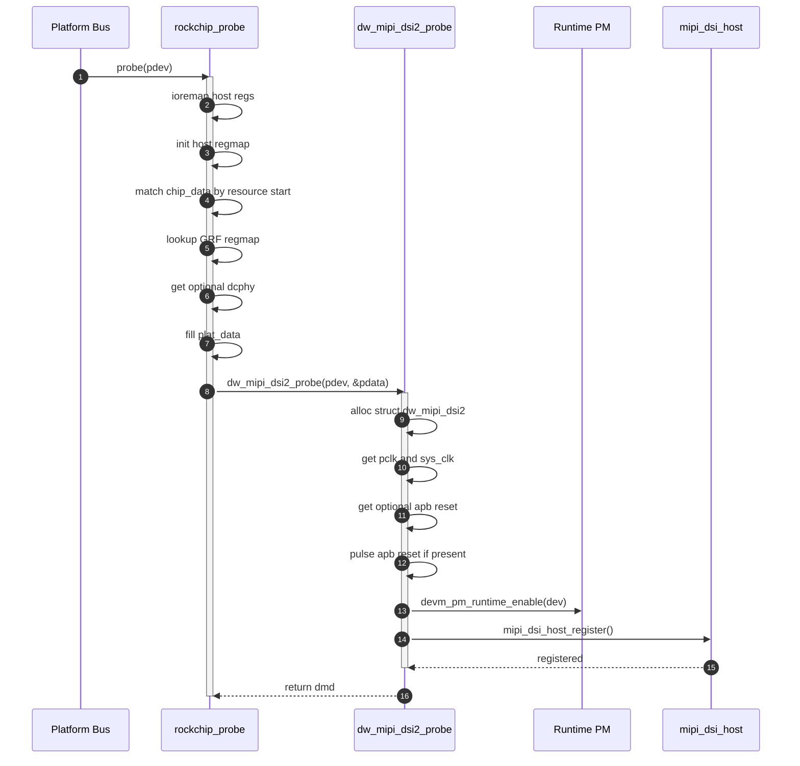
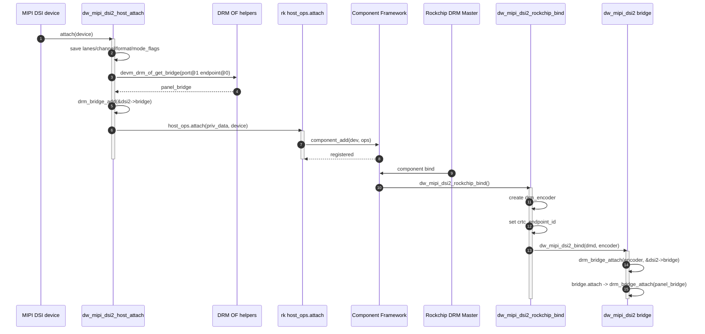
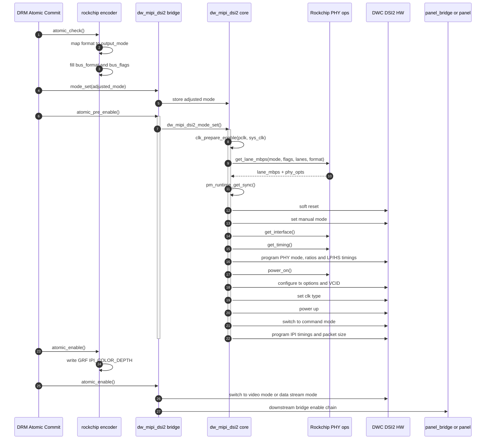
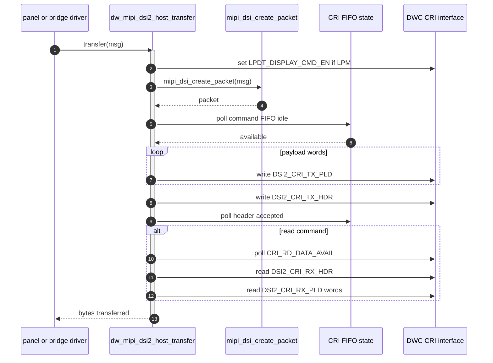
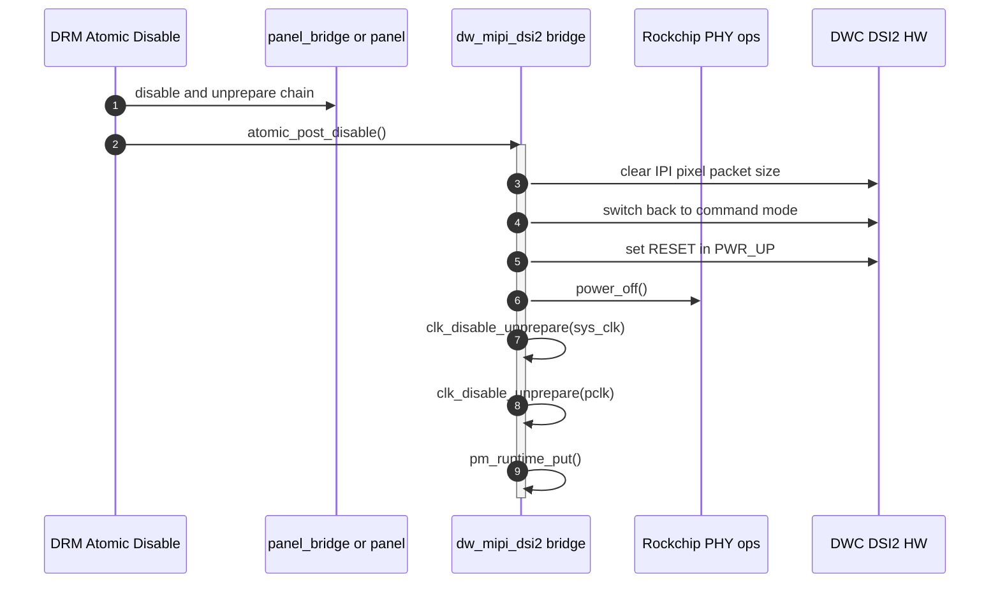

+++
date = '2026-07-09T19:27:34+08:00'
draft = true
title = '时序分析'
+++

# 时序分析

## 1. 总体时序视角

这套驱动最有代表性的运行场景有五个：

1. platform probe
2. DSI peripheral attach + component bind
3. atomic enable
4. DCS/Generic command transfer
5. atomic disable + remove

这里最重要的理解点是：

- probe 只把 host 注册出来
- attach 才把 bridge 和 component 拓扑拼上
- pre_enable 负责把 controller 置于 command-ready 状态
- enable 才真正切到 video/data-stream

## 2. Probe 时序

### 关键点

- `drm_bridge_add()` 不在 probe 里。
- `mipi_dsi_host_register()` 早于 bridge 拓扑建立。
- Rockchip 先准备平台上下文，再把它作为 `plat_data` 注入 generic core。

## 3. Attach 和 Bind 时序

这是本驱动最核心的拼装路径。

### 为什么要这样分两段

因为 encoder 属于 Rockchip DRM 世界，而 DSI peripheral attach 属于 MIPI DSI host 世界。这两个框架的发现时机不同，所以 driver 用：

- `host_attach()`
- `component_add()`
- `component bind`

把两个世界桥接起来。

## 4. Atomic Enable 时序

这个阶段分成三个子责任：

1. encoder `atomic_check`
2. bridge `mode_set` / `atomic_pre_enable`
3. encoder `atomic_enable` + bridge `atomic_enable`

### 4.1 参数准备阶段

`dw_mipi_dsi2_encoder_atomic_check()` 做的是“格式翻译”：

- DSI format -> `ROCKCHIP_OUT_MODE_*`
- connector display_info -> `bus_format`、`bus_flags`

`dw_mipi_dsi2_bridge_mode_set()` 做的是“缓存 adjusted mode”。

### 4.2 使能主时序

### 4.3 `dw_mipi_dsi2_mode_set()` 内部逻辑拆解

对应代码：

- `dw-mipi-dsi2.c:780-822`

顺序非常讲究：

1. 先开 `pclk` 和 `sys_clk`
2. 再计算 `lane_mbps`
3. 再 `pm_runtime_get_sync()`
4. 再 soft reset
5. 再写 manual mode 和 PHY timing
6. 再 `phy_power_on()`
7. 再根据模式设置连续/非连续 clock
8. 最后 `POWER_UP` 并进入 command mode

这里体现了一个关键思想：在切到 video/data-stream 之前，host 必须已经处于一个可以安全发送 command 的状态。

## 5. Command Transfer 时序

### 代码对应

- FIFO 空闲等待
  - `cri_fifos_wait_avail()`
  - `dw-mipi-dsi2.c:221-235`
- payload 写
  - `dw_mipi_dsi2_write()`
  - `dw-mipi-dsi2.c:585-610`
- 读返回包
  - `dw_mipi_dsi2_read()`
  - `dw-mipi-dsi2.c:612-648`
- host transfer 总入口
  - `dw_mipi_dsi2_host_transfer()`
  - `dw-mipi-dsi2.c:650-687`

### 这个时序说明了什么

显示数据流和控制命令流虽然都经过 DSI2 host，但代码路径完全不同：

- 视频流配置走 bridge enable 路径
- 命令流走 `mipi_dsi_host_ops.transfer`

这也是为什么 driver 在 `atomic_pre_enable()` 阶段会先把 host 置于 command mode。

## 6. Atomic Disable 时序

### 为什么 disable 时要先切回 command mode

代码注释已经讲得很明确：

- 先让面板 disable/unprepare
- 再把 DSI host 切回 command mode

对应：

- `dw-mipi-dsi2.c:756-762`

本质上这是为了确保 host 退出视频流状态后再断电，避免在 video/data stream 状态下直接 power off。

## 7. Remove / Detach 时序

### detach

`dw_mipi_dsi2_host_detach()` 做三件事：

1. 平台 `host_ops->detach()`
2. `drm_bridge_remove()`
3. `drm_of_panel_bridge_remove()`

位置：

- `dw-mipi-dsi2.c:549-567`

Rockchip 平台的 detach 只做：

- `component_del()`
- `dw-mipi-dsi2-rockchip.c:351-358`

### remove

Rockchip 顶层 remove：

- `dw_mipi_dsi2_remove(dsi2->dmd)`
- `dw-mipi-dsi2-rockchip.c:433-438`

generic core remove：

- `mipi_dsi_host_unregister()`
- `dw-mipi-dsi2.c:991-1009`

值得注意的是：

- `dw_mipi_dsi2_unbind()` 当前为空实现
  - `dw-mipi-dsi2.c:1023-1025`

这表示当前 encoder 与 generic bridge 的解绑更多依赖 DRM/component 自身的对象释放顺序，而不是在 generic core 中维护额外解绑状态。

## 8. 一句话总结时序特征

这份驱动的时序设计可以概括成一句话：

“先把 DSI host 作为 MIPI endpoint 建起来，再在下游 attach 后把它变成 DRM bridge，最后在 atomic pre_enable 中完成硬件上电和 command-ready，再进入 video 或 data-stream 工作态。”
