+++
date = '2026-07-26T23:38:46+08:00'
draft = false
title = 'u-boot spi 介绍'
categories = ["SPI"]
tags = ["U-Boot", "SPI"]
+++

# **1 简介**

SPI \(Serial Peripheral Interface\) 最初是 Motorola 提出的4线同步串行数据传输接口， 是一种高速、全双工的同步通信总线。SPI接口主要应用在 EEPROM，FLASH，实时时钟，AD转换器，还有数字信号处理器和数字信号解码器之间。


# **2 功能描述**

## **2\.1 总线模式**

### **2\.1\.1 标准4线SPI**

标准SPI通常就称SPI，它是一种串行外设接口规范，有4根引脚信号：sclk , cs, mosi, miso

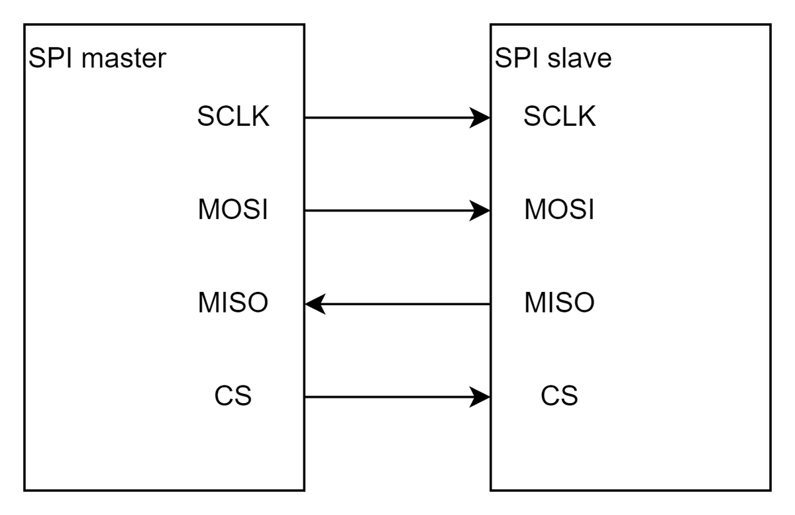

### **2\.1\.2 Dual SPI**

针对SPI Flash而言，不是针对所有SPI外设。对于SPI Flash，全双工并不常用，因此扩展了mosi和miso的用法，让它们工作在半双工，用以加倍数据传输。也就是对于Dual SPI Flash，可以发送一个命令字节进入dual mode，这样mosi变成SIO0（serial io 0），miso变成SIO1（serial io 1）,这样一个时钟周期内就能传输2个bit数据，加倍了数据传输。

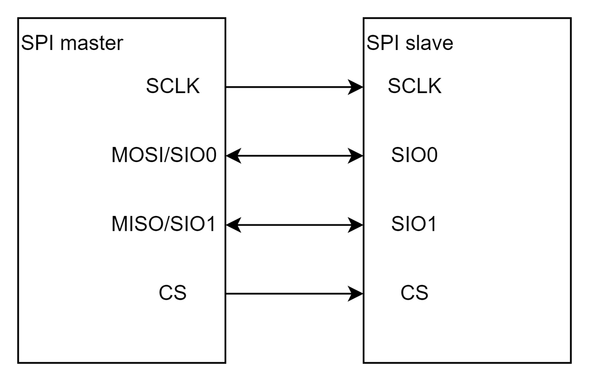


### **2\.1\.3 Qual SPI**

与Dual SPI类似，也是针对SPI Flash，Qual SPI Flash增加了两根I/O线（SIO2,SIO3），目的是一个时钟内传输4个bit。

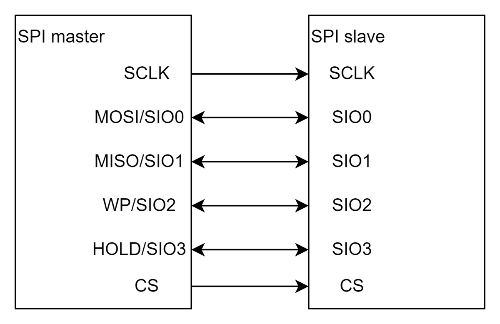


所以对于SPI Flash，有标准spi flash，dual spi , qual spi 三种类型，分别对应3\-wire, 4\-wire, 6\-wire，在相同clock下，线数越多，传输速率越高。


## **2\.2 传输模式**

SPI 通讯有 4 中不同的传输模式，通信双方需要配置成为一样的模式，才能够进行正常的数据传输，这里有两个概念，CPOL\(时钟极性\)，  CPHA\(时钟相位\)。

CPOL：决定SCLK这个时钟信号线，在没有数据传输的时候的电平状态。

CPOL=0：空闲状态时，SCLK保持低电平

CPOL=1：空闲状态时，SCLK保持高电平

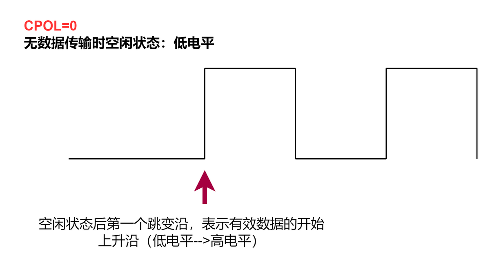


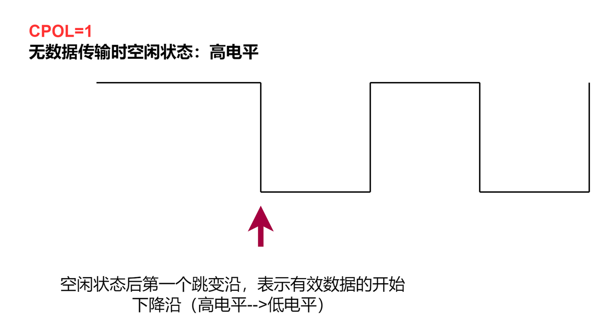


CPHA: 决定数据传输是从第一个时钟\(SCLK\)边沿开始，还是从第二个时钟边沿开始。

CPHA=0: 数据从第一个时钟\(SCLK\)边沿开始采集

CPHA=1: 数据从第二个时钟边沿开始采集


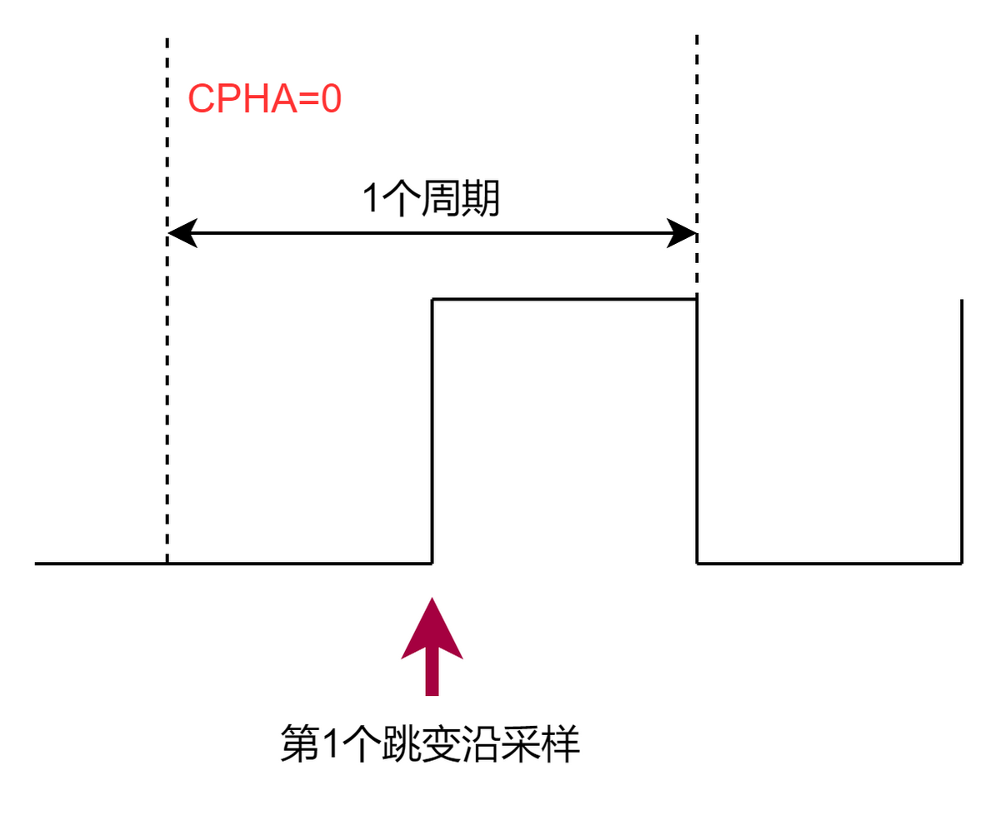


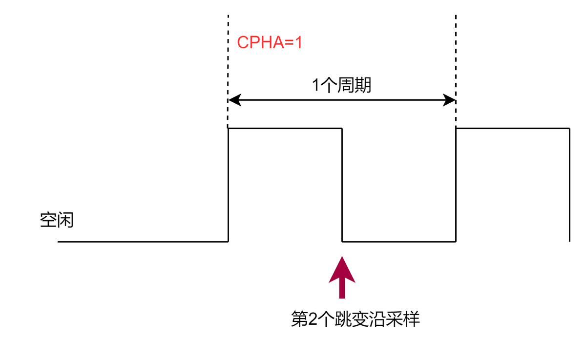


### **2\.1\.1 模式0（CPOL=0, CPHA=0）**

模式0特性：

CPOL = 0：空闲时是低电平，第1个跳变沿是上升沿，第2个跳变沿是下降沿

CPHA = 0：数据在第1个跳变沿（上升沿）采样

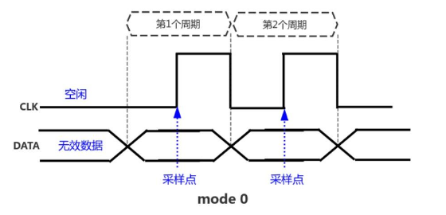


### **2\.1\.2 模式1 \(CPOL=0, CPHA=1\)**

CPOL = 0：空闲时是低电平，第1个跳变沿是上升沿，第2个跳变沿是下降沿

CPHA = 1：数据在第2个跳变沿（下降沿）采样

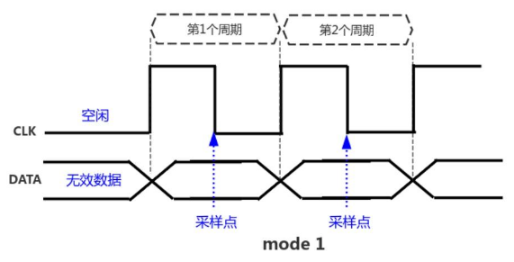


### **2\.1\.3 模式2 \(CPOL=1, CPHA=0\)**

CPOL = 1：空闲时是高电平，第1个跳变沿是下降沿，第2个跳变沿是上升沿

CPHA = 0：数据在第1个跳变沿（下降沿）采样

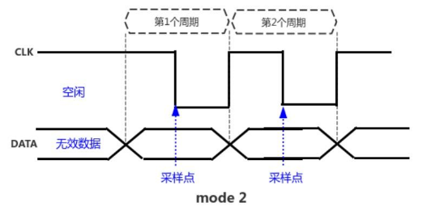


### **2\.1\.4 模式3 \(CPOL=1, CPHA=1\)**

CPOL = 1：空闲时是高电平，第1个跳变沿是下降沿，第2个跳变沿是上升沿

CPHA = 1：数据在第2个跳变沿（上升沿）采样

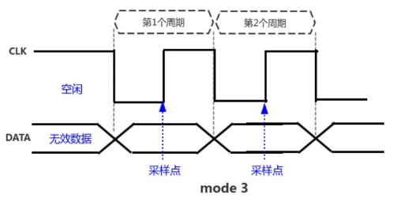


# **3 WINBOND W25Q256JV**

## 3\.1 功能描述

### 3\.1\.1 spi flash操作流程

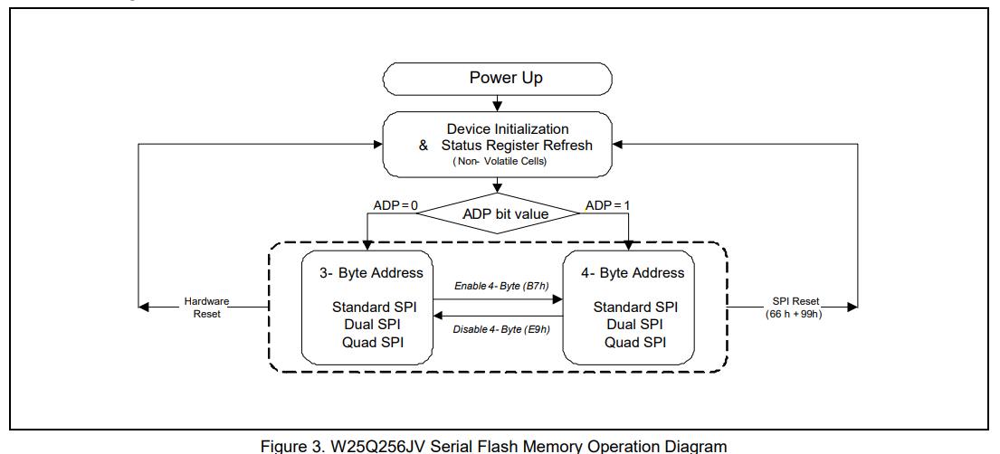

### 3\.1\.2 标准 SPI 指令

W25Q256JV 通过一个兼容 SPI 的总线进行访问，该总线包含四个信号：串行时钟（CLK）、片选（/CS）、串行数据输入（DI） 和 串行数据输出（DO）。标准的 SPI 指令通过 **DI** 输入引脚，在 **CLK** 上升沿将指令、地址或数据串行写入设备。DO 输出引脚用于在 **CLK** 下降沿从设备读取数据或状态。

SPI 总线操作模式 0（0,0）和 3（1,1）都支持。模式 0 和模式 3 之间的主要区别在于，当 SPI 总线主设备处于待机状态且数据没有传输到串行闪存时，CLK信号的正常状态。

- 在模式 0 中，/CS 的下降沿和上升沿时，CLK 信号通常为低电平。

- 在模式 3 中，/CS 的下降沿和上升沿时，CLK 信号通常为高电平。


### 3\.1\.3 Quad SPI Instructions

W25Q256JV 支持在使用诸如 “Fast Read Quad Output  \(6Bh\)” 和 “Fast Read Quad I/O \(EBh\)” 等指令时进行四 SPI 操作。这些指令允许数据以普通串行闪存的四到六倍速度进行传输。四读取指令显著提高了随机访问传输速率，从而支持快速代码复制到 RAM 或直接从 SPI 总线执行（XIP）。

在使用四 SPI 指令时，DI和 **DO** 引脚变为双向 **IO0** 和 IO1，而 **/WP** 和 **/HOLD** 引脚分别变为 **IO2** 和 IO3。四 SPI 指令要求在 **状态寄存器 2** 中设置非易失性的 **Quad Enable \(QE\)** 位。

### 3\.1\.4 3\-Byte / 4\-Byte Address Modes

W25Q256JV 提供了两种地址模式，可用于指定存储阵列中的任何字节数据。

- **3字节地址模式**：该模式与旧一代仅支持最高 128Mbit数据的串行闪存内存向后兼容。要在 3 字节地址模式下寻址 256Mbit或更大容量的数据，必须在 3 字节地址之外使用扩展地址寄存器。

- **4字节地址模式**：此模式旨在支持从 256Mbit到 32Gbit 的串行闪存内存设备。当启用 4 字节地址模式时，不需要使用扩展地址寄存器。

在上电时，W25Q256JV 可以根据非易失性状态寄存器位 **ADP \(S17\)** 的设置，在 **3 字节地址模式** 或 **4 字节地址模式** 之间操作。如果 ADP = 0，则设备将在 3 字节地址模式下运行；如果 ADP = 1，则设备将在 4 字节地址模式下运行。ADP的出厂默认值为 0。

要在 3 字节地址模式和 4 字节地址模式之间切换，必须使用 “进入 4 字节模式（B7h）” 或 “退出 4 字节模式（E9h）” 指令。当前的地址模式由状态寄存器位 **ADS \(S16\)** 指示。

W25Q256JV 还支持一组基本的 SPI 指令，这些指令需要专用的 4 字节地址，不论设备的地址模式设置如何。有关详细信息，请参阅指令集表 2。

## 3\.2 指令

W25Q256JV 的 **标准/双/四 SPI 指令集** 包含 48 个基本指令，这些指令通过 SPI 总线完全控制（参见指令集表 1\-4）。指令通过 **片选（/CS）** 的下降沿启动。输入到 **DI** 引脚的第一个字节数据提供了指令代码。数据通过时钟的上升沿被采样，且按 **最有效位（MSB）** 优先的顺序输入。

指令的长度从单字节到多个字节不等，后面可能会跟 地址字节、数据字节、虚拟字节（不关心）以及在某些情况下的组合。指令在 **/CS** 上升沿完成。每个指令的时钟相对时序图包含在 **图 5 到图 57** 中。所有读取指令可以在任何时钟位之后完成。然而，所有执行写、编程或擦除的指令必须在字节边界完成（即在完整的 8 位时钟信号传输后，/CS 被拉高），否则该指令将被忽略。此功能进一步保护设备免受意外写入。

此外，在内存正在进行编程或擦除，或正在写入状态寄存器时，除 **读取状态寄存器** 指令外，所有其他指令都将被忽略，直到编程或擦除周期完成。


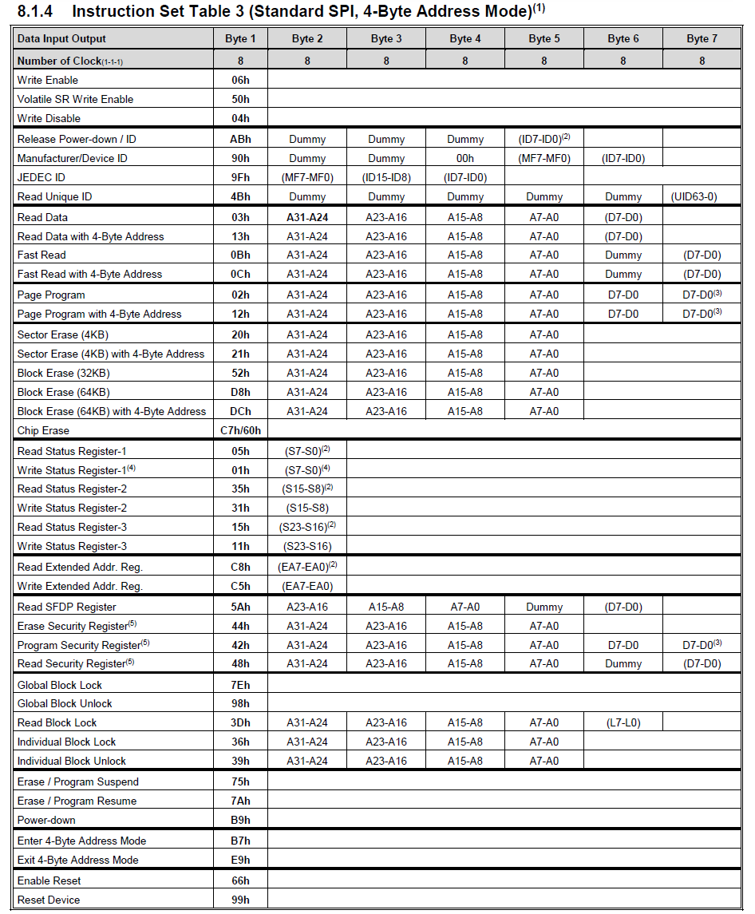

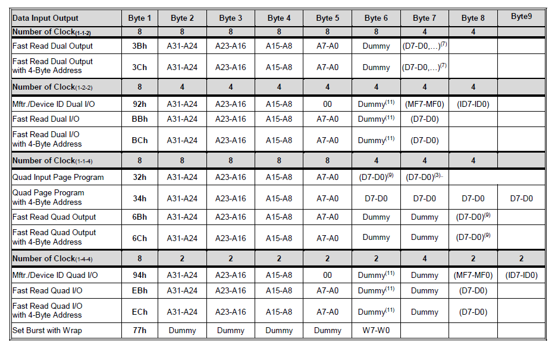

### 3.2.1 **读\(03H\)协议解析**


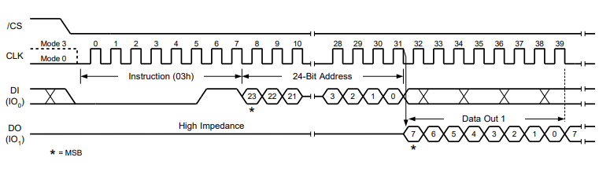

读数据的过程，同样也是先 CS 拉低，在写入读数据的指令（0x03），接着跟 24\-bit 的地址信息。然后一直发送 Dummy Data，同时读到指定的数据到 BUFFER


# **4 uboot spi存储器软件框架**


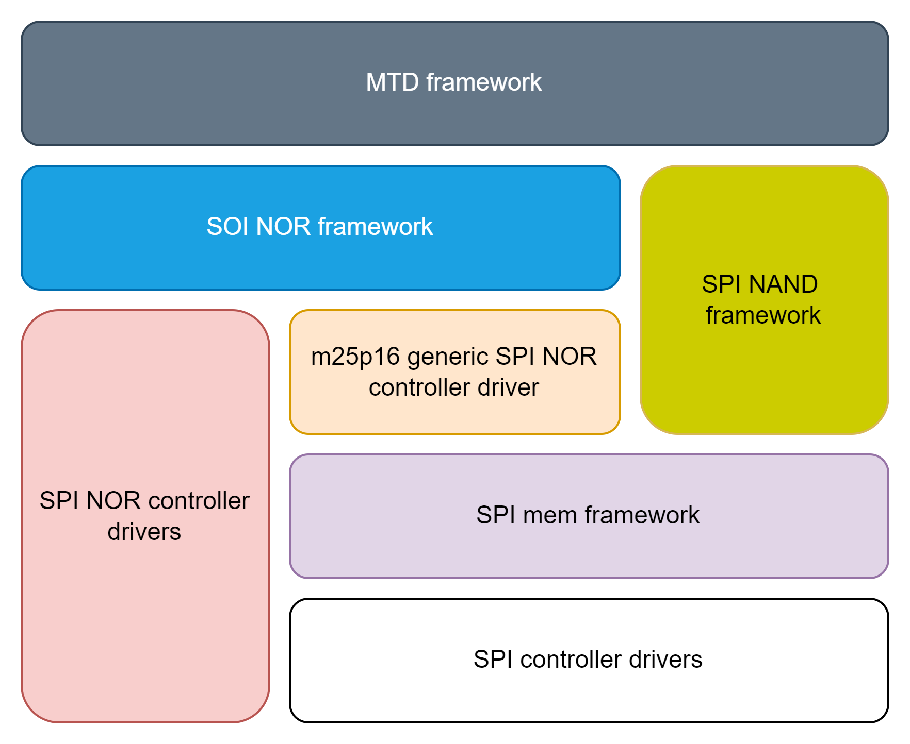


|**模块**|**描述**|**代码目录**|
|---|---|---|
|spi controller |传统的spi总线控制器驱动，针对spi存储设备特性，在数据结构中增加了新的回调函数集|drivers/spi/spi\-sifive\.c<br>|
|spi mem framework|提供了针对flash的指令，封装数据结构，提供发送数据、检查属性等接口|drivers/spi/spi\-mem\.c|
|m25p16 generic spi nor controller driver|通用 SPI NOR 控制器驱动程序|drivers/mtd/spi/sf\_probe\.c|
|spi nor framework|处理不同厂家的NOR 物理特色差异，初始化SPINOR的工作状态，如工作线宽（1 线、2 线、4 线、8 线）、有效地址位（16M 以上的NOR 需要使用4 地址模式），为上层MTD 提供读写擦接口|drivers/mtd/spi/spi\-nor\-core\.c|
|Spi nor controller drivers|传统spi nor驱动，实现spi nor控制器驱动|drivers/mtd/altera\_qspi\.c|


## 4\.1 spi nor framework

### 4\.1\.1 背景

SPI总线控制器（drivers/spi/XXX）仅处理字节流；控制器在操作时与连接的具体设备无关。然而，某些控制器（如Freescale的QuadSPI控制器）不能轻易处理任意的字节流，而是专为SPI NOR设计。

特别是，Freescale的QuadSPI控制器必须了解NOR的命令才能找到正确的查找表（LUT）序列。不幸的是，SPI子系统对操作码、地址或数据负载没有概念；SPI控制器只知道发送或接收字节（Tx和Rx）。因此，我们必须在控制器驱动程序下定义一种新的分层方案，使其了解SPI NOR协议的操作码、寻址以及其他细节。

这个框架在MTD（Memory Technology Devices，内存技术设备）和SPI总线驱动程序之间增加了一个新层。有了这个新层，SPI NOR 控制器驱动程序不再依赖于 m25p80 代码了。

```C++
MTD
------------------------
         m25p80
------------------------
      SPI bus driver
------------------------
       SPI NOR chip

/*-------------------------------------------------------------------------------------
    修改后
-------------------------------------------------------------------------------------*/

          MTD
------------------------
     SPI NOR framework
------------------------
         m25p80
------------------------
      SPI bus driver
------------------------
      SPI NOR chip
```


### 4\.1\.2 数据结构

1. **struct spi\_nor**

```C++
struct spi_nor {
    struct mtd_info     mtd;  // 指向mtd_info结构体，所有的存储设备，最终都有可以挂载到mtd子系统中
    struct udevice      *dev; // 指向spi nor设备
    struct spi_slave    *spi; // 来自spi controll uclass
    const struct flash_info *info;  // flash 信息
    u8          *manufacturer_sfdp;
    u32         page_size;          // SPI NOR的页面大小
    u8          addr_width;        // 地址字节数
    u8          erase_opcode;      //  用于擦除扇区的操作码
    u8          read_opcode;       // 读操作码
    u8          read_dummy;        // 读取操作所需的dummy数
    u8          program_opcode;
    u8          rdsr_dummy;
    u8          rdsr_addr_nbytes;
    enum spi_nor_protocol   read_proto;  //  用于读取操作的SPI协议
    enum spi_nor_protocol   write_proto; // 用于写操作的SPI协议
    enum spi_nor_protocol   reg_proto;   // 用于读\写\擦除操作的SPI协议
    bool            sst_write_second;
    u32         flags;
    u8          cmd_buf[SPI_NOR_MAX_CMD_SIZE];
    enum spi_nor_cmd_ext    cmd_ext_type;
    struct spi_nor_fixups   *fixups;

    int (*setup)(struct spi_nor *nor, const struct flash_info *info,
             const struct spi_nor_flash_parameter *params);
    int (*prepare)(struct spi_nor *nor, enum spi_nor_ops ops);
    void (*unprepare)(struct spi_nor *nor, enum spi_nor_ops ops);
    int (*read_reg)(struct spi_nor *nor, u8 opcode, u8 *buf, int len);
    int (*write_reg)(struct spi_nor *nor, u8 opcode, u8 *buf, int len);

    ssize_t (*read)(struct spi_nor *nor, loff_t from,
            size_t len, u_char *read_buf);
    ssize_t (*write)(struct spi_nor *nor, loff_t to,
             size_t len, const u_char *write_buf);
    int (*erase)(struct spi_nor *nor, loff_t offs);

    int (*flash_lock)(struct spi_nor *nor, loff_t ofs, uint64_t len);
    int (*flash_unlock)(struct spi_nor *nor, loff_t ofs, uint64_t len);
    int (*flash_is_unlocked)(struct spi_nor *nor, loff_t ofs, uint64_t len);
    int (*quad_enable)(struct spi_nor *nor);
    int (*octal_dtr_enable)(struct spi_nor *nor);
    int (*ready)(struct spi_nor *nor);

    void *priv;
    char mtd_name[MTD_NAME_SIZE(MTD_DEV_TYPE_NOR)];
/* Compatibility for spi_flash, remove once sf layer is merged with mtd */
    const char *name;
    u32 size;
    u32 sector_size;
    u32 erase_size;
};
```


`struct spi_nor`即是struct spi\_flash, 作为`struct uclass_driver spi_flash`的私有数据；

device\_probe时，通过device\_of\_to\_plat\-\>device\_alloc\_priv 分配了空间，并将地址存储到device\-\>uclass\_priv\_


### 4\.1\.3 对外函数

spi\_nor\_scan\(struct spi\_nor \*nor\)

```C++
int spi_nor_scan(struct spi_nor *nor)
{
    struct spi_nor_flash_parameter params;
    const struct flash_info *info = NULL;
    struct mtd_info *mtd = &nor->mtd;
    struct spi_nor_hwcaps hwcaps = {
        .mask = SNOR_HWCAPS_READ |
            SNOR_HWCAPS_READ_FAST
    };
    struct spi_slave *spi = nor->spi;
    int ret;

    /* Reset SPI protocol for all commands. */
    nor->reg_proto = SNOR_PROTO_1_1_1;
    nor->read_proto = SNOR_PROTO_1_1_1;
    nor->write_proto = SNOR_PROTO_1_1_1;

    if (spi->mode & SPI_RX_QUAD)
        hwcaps.mask |= SNOR_HWCAPS_READ_1_1_4;

    info = spi_nor_read_id(nor);
    if (IS_ERR_OR_NULL(info))
        return PTR_ERR(info);
    /* Parse the Serial Flash Discoverable Parameters table. */
    ret = spi_nor_init_params(nor, info, &params); // 设置read opcode
    if (ret)
        return ret;

    mtd->name = "spi-flash";
    mtd->dev = nor->dev;
    mtd->priv = nor;
    mtd->type = MTD_NORFLASH;
    mtd->writesize = 1;
    mtd->flags = MTD_CAP_NORFLASH;
    mtd->size = info->sector_size * info->n_sectors;
    mtd->_erase = spi_nor_erase;
    mtd->_read = spi_nor_read;
    mtd->_write = spi_nor_write;

    nor->size = mtd->size;

    if (info->flags & USE_FSR)
        nor->flags |= SNOR_F_USE_FSR;
    if (info->flags & USE_CLSR)
        nor->flags |= SNOR_F_USE_CLSR;

    if (info->flags & SPI_NOR_NO_FR)
        params.hwcaps.mask &= ~SNOR_HWCAPS_READ_FAST;

    /*
     * Configure the SPI memory:
     * - select op codes for (Fast) Read, Page Program and Sector Erase.
     * - set the number of dummy cycles (mode cycles + wait states).
     * - set the SPI protocols for register and memory accesses.
     * - set the Quad Enable bit if needed (required by SPI x-y-4 protos).
     */
    ret = spi_nor_setup(nor, info, &params, &hwcaps);
    if (ret)
        return ret;

    if (nor->addr_width) {
        /* already configured from SFDP */
    } else if (info->addr_width) {
        nor->addr_width = info->addr_width;
    } else if (mtd->size > 0x1000000) {
        /* enable 4-byte addressing if the device exceeds 16MiB */
        nor->addr_width = 4;
        if (JEDEC_MFR(info) == SNOR_MFR_SPANSION ||
            info->flags & SPI_NOR_4B_OPCODES)
            spi_nor_set_4byte_opcodes(nor, info);
    } else {
        nor->addr_width = 3;
    }

    if (nor->addr_width > SPI_NOR_MAX_ADDR_WIDTH) {
        dev_dbg(nor->dev, "address width is too large: %u\n",
            nor->addr_width);
        return -EINVAL;
    }

    /* Send all the required SPI flash commands to initialize device */
    nor->info = info;
    ret = spi_nor_init(nor);
    if (ret)
        return ret;

    return 0;
}
```

14\~16: 设置读写的协议为SNOR\_PROTO\_1\_1\_1

18\~19: 判断nor flash bus宽度\(1, 2, 4, 8\)是否是quad

21\~23: 通过调用控制器提供的read\_reg函数，读取flash的JEDEC ID，并且从spi\_nor\_ids匹配是否支持该flash。如下是spi\_nor\_ids这个全局变量\.

```C++
{ INFO("w25q256", 0xef4019, 0, 64 * 1024, 512, SECT_4K | SPI_NOR_DUAL_READ | SPI_NOR_QUAD_READ | SPI_NOR_NO_FR ) },
```

```C++
spi_nor_read_id
  |->spi_nor_read_reg
    |-> spi_nor_read_write_reg
      |-> spi_mem_exec_op
        |-> spi_xfer
```

25\~27：根据flash\_info中flag的标志，通过分析norflash的硬件能力去设置`spi_nor_flash_parameter`的hwcaps以及read opcode。

例如，上面的例子中的flash info的flag为 `SECT_4K | SPI_NOR_DUAL_READ | SPI_NOR_QUAD_READ | SPI_NOR_NO_FR`

29\~40: 设置mtd\_info  mtd成员变量

42\~45：根据flash\_info中flag的标志，  设置spi\-\>nor中flag的标志

47\~48：这里针对SPI\_NOR\_NO\_FR是多余的。这个设置是为了flash支持四线，但不想使能fast mode使用。

57\~59：选择\(Fast\)读取的操作码， 设置虚拟周期数， 设置用于寄存器和存储器访问的SPI协议

61\~73：根据`mtd->size = info->sector_size * info->n_sectors`设置地址宽度, 这里的地址宽度会被用于`spi_nor_read_data` 的` struct spi_mem_op op`中

82\~85：发送SPI 闪存命令以初始化nor flash


## 4\.2 spi mem framework

### 4\.2\.1 背景

最早spi nor有单独的驱动，芯片厂商根据使用的spi控制器驱动，实现对应的spi\-nor驱动。spi\-nor驱动只分为driver和core层。但是这种情况下，该spi控制器，就不能再提供给其他外设使用了。以及随着SPI Nand的流行。spi\-nor的驱动并不适用于spi\-nand。

  不管是单线、双线、四线模式下，对于底层控制器来说，spi\-nor、spi\-nand的发送逻辑是一样的，都是opcode\-addr\-dummy\-data。且底层控制器不关心具体上层逻辑差异。所以驱动分层就显得十分重要了。

  在这个背景下，spi\-mem驱动应运而生。Spi mem的出现为SPI存储器生态带来一些一致性，该框架实现了在spi nor设备、spi nand设备、以及常规spi外设上复用spi控制器驱动的功能。


### 4\.2\.2 数据结构

1. **struct spi\_slave **

spi\-mem是一个spi总线从设备驱动，使用`struct spi_slave *slave`来描述一个spi存储设备。

```C++
struct spi_slave {
#if CONFIG_IS_ENABLED(DM_SPI)
    struct udevice *dev;    /* struct spi_slave is dev->parentdata */
    uint max_hz;
#else
    unsigned int bus;
    unsigned int cs;
#endif
    uint mode;
    unsigned int wordlen;
    unsigned int max_read_size;
    unsigned int max_write_size;
    void *memory_map;

    u8 flags;
#define SPI_XFER_BEGIN      BIT(0)  /* Assert CS before transfer */
#define SPI_XFER_END        BIT(1)  /* Deassert CS after transfer */
#define SPI_XFER_ONCE       (SPI_XFER_BEGIN | SPI_XFER_END)
};
```

2. **struct spi\_mem\_op**

该结构体表示一次对spi存储器的操作。提供给上层存储器驱动使用。

通常spi存储器的操作，包括`opcode（cmd）、addr、dummy、data`。注意，`buswidth`代表`single、dual、quad`传输。

```C++
struct spi_mem_op {
    struct {
        u8 nbytes;
        u8 buswidth;
        u8 dtr : 1;
        u16 opcode;
    } cmd;

    struct {
        u8 nbytes;
        u8 buswidth;
        u8 dtr : 1;
        u64 val;
    } addr;

    struct {
        u8 nbytes;
        u8 buswidth;
        u8 dtr : 1;
    } dummy;

    struct {
        u8 buswidth;
        u8 dtr : 1;
        enum spi_mem_data_dir dir;
        unsigned int nbytes;
        /* buf.{in,out} must be DMA-able. */
        union {
            void *in;
            const void *out;
        } buf;
    } data;
};
---------------------------------------------------------------------------
struct spi_mem_op op =
        SPI_MEM_OP(SPI_MEM_OP_CMD(nor->read_opcode, 1),
               SPI_MEM_OP_ADDR(nor->addr_width, from, 1),
               SPI_MEM_OP_DUMMY(nor->read_dummy, 1),
               SPI_MEM_OP_DATA_IN(len, buf, 1));
```


3. **struct  spi\_controller\_mem\_ops**

提供给`spi_controller`注册需要使用的回调函数集。一个希望优化SPI存储器操作的spi控制器，都可以实现该回调函数集

```C++
struct spi_controller_mem_ops {
    int (*adjust_op_size)(struct spi_slave *slave, struct spi_mem_op *op);
    bool (*supports_op)(struct spi_slave *slave,
                const struct spi_mem_op *op);
    int (*exec_op)(struct spi_slave *slave,
               const struct spi_mem_op *op);
};

```

- **adjust\_op\_size**：调整存储器操作的数据传输大小，以符合对齐要求和最大FIFO大小的约束。用于校正单次spi存储器传输数据长度。如单次要求读取1024字节，但是控制器只支持单次512字节传输，那么在此回调中，就需要将spi\_mem\_op\-\>data\.nbytes限制到512字节。

例子：

```C++
static int dw_spi_adjust_op_size(struct spi_slave *slave, struct spi_mem_op *op)
{
    op->data.nbytes = min(op->data.nbytes, (unsigned int)SZ_64K);

    return 0;
}
```


- **supports\_op**：spi\-nor、spi\-nand通常支持多种模式，单线、四线、各个模式的cmd（opcode）各不相同，在驱动初始化的时候，需要通过support\_op，确认控制器是否支持该命令。只有flash和控制器都能支持的传输模式，flash才能正常工作。通常情况下，不需要实现该函数，使用spi\-mem默认的即可满足需求。代码如下：

```C++
bool spi_mem_supports_op(struct spi_slave *slave,
             const struct spi_mem_op *op)
{
    struct udevice *bus = slave->dev->parent;
    struct dm_spi_ops *ops = spi_get_ops(bus);

    if (ops->mem_ops && ops->mem_ops->supports_op)
        return ops->mem_ops->supports_op(slave, op);

    return spi_mem_default_supports_op(slave, op);
}
```


- **exec\_op**：执行存储器操作，即实现如何发送、接受一次flash的操作。不实现该回调函数，spi\-mem会用默认的传输模式，即使用传统spi\_xfer方式，进行spi存储器操作。

### 4\.2\.3 对外函数

spi\-mem对上层提供flash操作接口, 分别对应上述`struct spi_controller_mem_ops`回调函数。

```C++
int spi_mem_adjust_op_size(struct spi_slave *slave, struct spi_mem_op *op)
bool spi_mem_supports_op(struct spi_slave *slave, const struct spi_mem_op *op)
int spi_mem_exec_op(struct spi_slave *slave, const struct spi_mem_op *op)
```


# 5 设备绑定流程

## 5\.1 spl阶段

```C
board_init_f
  |->spl_early_init
    |->spl_common_init
      |->dm_init_and_scan
        |-> dm_init
          |-> device_bind_by_name
            |-> lists_driver_lookup_name  // 通过root_info-name 获取driver
            |-> device_bind_common
              |-> struct udevice *dev = calloc
              |-> uclass_bind_device     // 将同类device绑定到对应的class
                |-> list_add_tail(&dev->uclass_node, &uc->dev_head);
          |-> device_probe               // 对根设备执行probe操作
        |-> dm_scan
          |-> dm_scan_plat
            |-> lists_bind_drivers      // 从平台设备中解析udevice,uclass
          |-> dm_extended_scan            // 从dtb中解析udevice,uclass
            |-> dm_scan_fdt
              |-> dm_scan_fdt_node        // 遍历dts节点
                |-> ofnode_is_enabled     // 判断节点有效性
                |-> lists_bind_fdt
                  |-> ofnode_get_name      // 获取节点名称
                  |-> ofnode_get_property  // 获取节点属性
                  |-> driver_check_compatible          // 检查匹配情况
                  |-> device_bind_with_driver_data     // driver 和device 绑定
                    |-> device_bind_common                // 创建device并与driver绑定
                      |-> uclass_get
                      |-> struct udevice *dev = calloc
                      |-> uclass_bind_device            // 将同类device绑定到对应的class
                      |-> list_add_tail(&dev->uclass_node, &uc->dev_head);
          |-> dm_probe_devices
```

# 6 spi nor flash/spi controller probe

```C++
board_init_r
  |-> spl_spi_load_image (common/spl/spl_spi.c:96)
    |-> spi_flash_probe (drivers/mtd/spi/sf-uclass.c)
      |-> _spi_get_bus_and_cs (drivers/spi/spi-uclass.c)
        |-> uclass_get_device_by_seq  // 通过指定class id,以及seq找到udevice, 也就是host spi，并进行spi host probe
        |-> spi_find_chip_select  // 找到host, spi上slave设备。host ip（spi）的child device是怎么绑定自己的？
        |-> device_active(dev) // 判定该device(spi slave)是否DM_FLAG_ACTIVATED
          |-> device_probe (divers/core/device.c) // device未probe的情况下，初始化device(spi slave)
            |-> spi_flash_std_probe (drivers/mtd/spi/sf_probe.c)
              |->spi_flash_probe_slave(drivers/mtd/spi/sf_probe.c)
                |-> spi_claim_bus
                  |-> dm_spi_claim_bus
                |-> spi_nor_scan (drivers/mtd/spi/spi-nor-core.c)
                  |-> spi_nor_read_id
                |-> spi_flash_mtd_register
        |-> spi_set_speed_mode // 进而调用host提供的set_speed set_mode

```


# 7 read

```C++
spi_flash_read (include/spi_flash.h)
  |->spi_flash_read_dm (drivers/mtd/spi/sf-uclass.c)
    |-> spi_flash_std_read (drivers/mtd/spi/sf_probe.c)
      |-> spi_nor_read (drivers/mtd/spi/spi-nor-core.c)
        |-> spi_nor_read_data (drivers/mtd/spi/spi-nor-core.c)
```


# QA:

## 1 spi\_find\_chip\_select 寻找slave?

int spi\_find\_chip\_select\(struct udevice \*bus, int cs, struct udevice \*\*devp\)

此函数里通过bus\(spi host device\)的child\_head去寻找其slave, 那么其slave是怎么绑定到自身的？

在dts中，flash作为spi的字节点。在扫描dts时，将spi做为父节点，通过`device_bind_with_driver_data`绑定。

```C++
static int dm_scan_fdt_node(struct udevice *parent, ofnode parent_node,
                bool pre_reloc_only)
{
    int ret = 0, err = 0;
    ofnode node;

    if (!ofnode_valid(parent_node))
        return 0;

    for (node = ofnode_first_subnode(parent_node);
         ofnode_valid(node);
         node = ofnode_next_subnode(node)) {
        const char *node_name = ofnode_get_name(node);

        if (!ofnode_is_enabled(node)) {
            pr_debug("   - ignoring disabled device\n");
            continue;
        }
        printf("[%s:%d] parent->name:%s----->\n", __func__, __LINE__, parent->name);
        err = lists_bind_fdt(parent, node, NULL, NULL, pre_reloc_only);
        if (err && !ret) {
            ret = err;
            debug("%s: ret=%d\n", node_name, ret);
        }
    }

    if (ret)
        dm_warn("Some drivers failed to bind\n");

    return ret;
}
```

```C++
[dm_scan_fdt_node:288] parent->name:root_driver----->
[dm_scan_fdt_node:288] parent->name:root_driver----->
[dm_scan_fdt_node:288] parent->name:root_driver----->
[device_bind_common:146] parent->name:root_driver----->
[device_bind_common:147] dev->name:spi_clk----->
[dm_scan_fdt_node:288] parent->name:root_driver----->
[device_bind_common:146] parent->name:root_driver----->
[device_bind_common:147] dev->name:soc----->
[dm_scan_fdt_node:288] parent->name:soc----->
[dm_scan_fdt_node:288] parent->name:soc----->
[dm_scan_fdt_node:288] parent->name:soc----->
[device_bind_common:146] parent->name:soc----->
[device_bind_common:147] dev->name:uart0@10000000----->
[dm_scan_fdt_node:288] parent->name:soc----->
[device_bind_common:146] parent->name:soc----->
[device_bind_common:147] dev->name:sdmmc@1000a000----->
[device_bind_common:146] parent->name:sdmmc@1000a000----->
[device_bind_common:147] dev->name:sdmmc@1000a000.blk----->
[dm_scan_fdt_node:288] parent->name:soc----->
[device_bind_common:146] parent->name:soc----->
[device_bind_common:147] dev->name:spi@10007000----->
[dm_scan_fdt_node:288] parent->name:spi@10007000----->
[device_bind_common:146] parent->name:spi@10007000----->
[device_bind_common:147] dev->name:flash@0----->
```


[标准SPI、DUAL SPI、Quad SPI\-CSDN博客 ](https://blog.csdn.net/woshiyuzhoushizhe/article/details/90447327)

[Linux SPI驱动框架\(4\)——spi\-mem驱动\_spi\_mem\_op\-CSDN博客 ](https://blog.csdn.net/weixin_42262944/article/details/120807758)

[spi协议时序图和四种模式实际应用详解 \- 知乎 \(](https://zhuanlan.zhihu.com/p/472343748)[zhihu\.com](https://zhuanlan.zhihu.com/p/472343748)[\) ](https://zhuanlan.zhihu.com/p/472343748)

https://blog\.csdn\.net/weixin\_42262944/category\_9513533\.html

[mtd](https://blog.csdn.net/u013836909/category_9052536.html)


